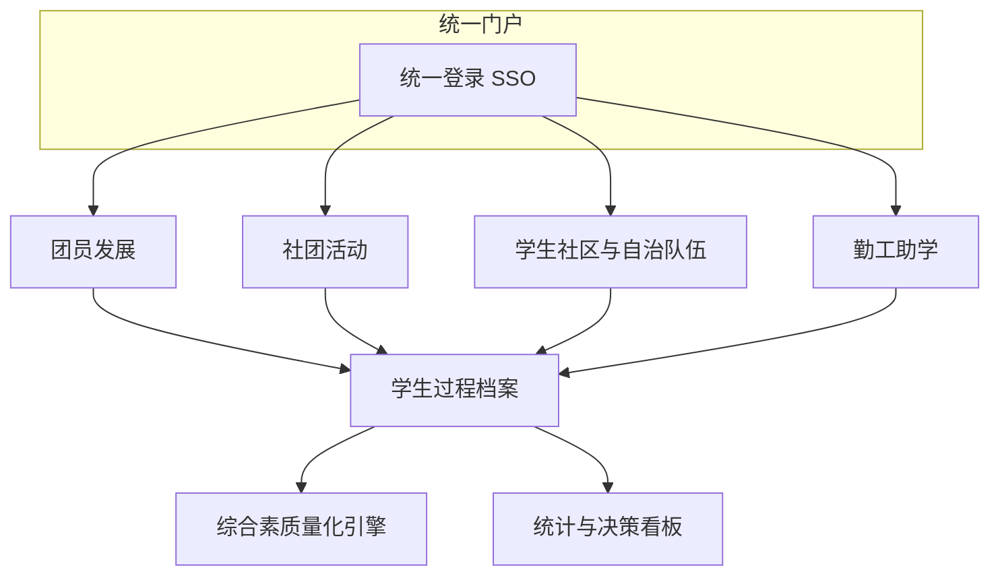
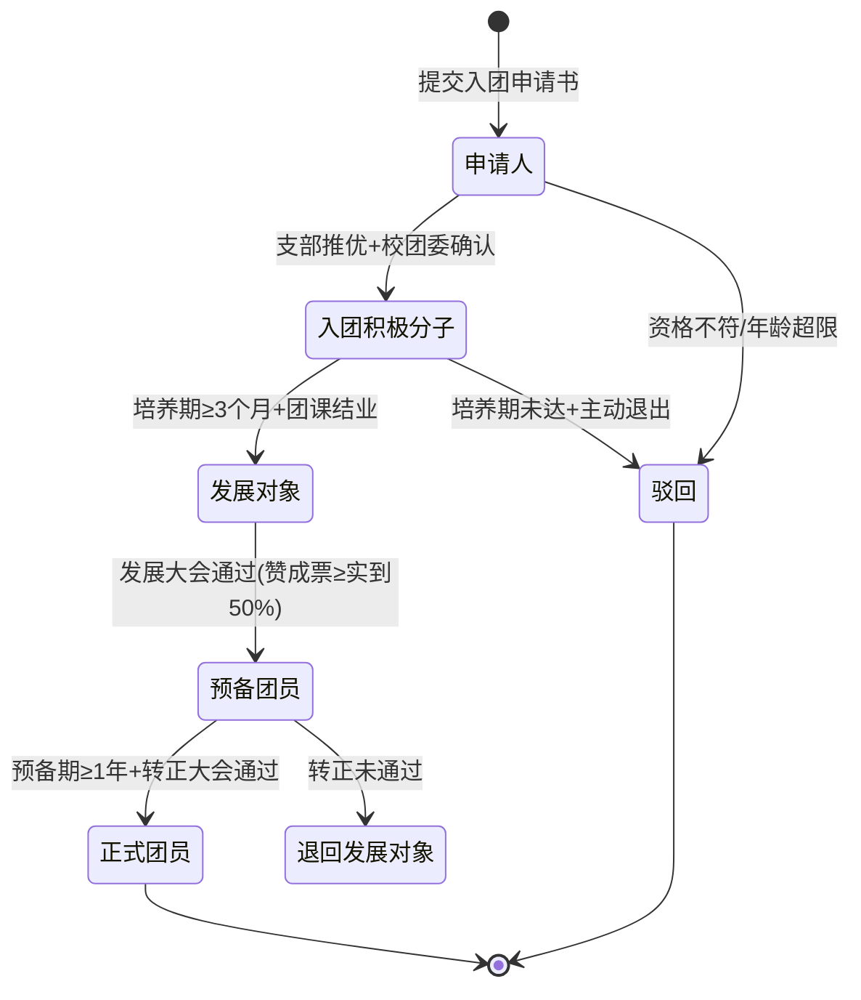
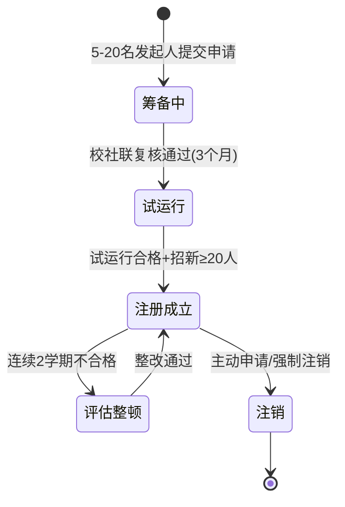
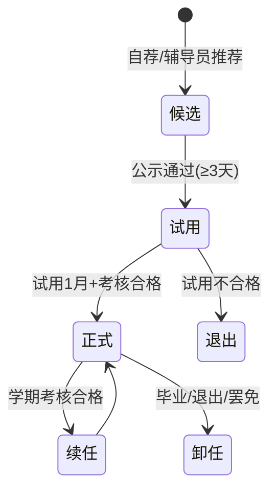
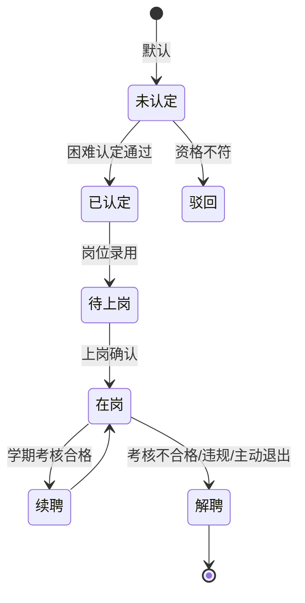
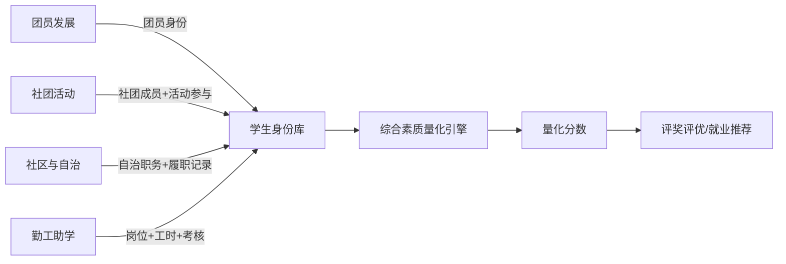

# 学生"一站式"自主管理过程管理系统 · 产品需求文档（PRD）

| 文档版本 | 修订日期       | 编写者        | 文档状态   |
| -------- | -------------- | ------------- | ---------- |
| V1.0     | 2026-06-14     | CPO（产品）   | 评审稿     |

---

## 0. 文档目的与适用范围

### 0.1 文档目的
本文档作为《学生"一站式"自主管理过程管理系统》业务侧的唯一权威需求说明，覆盖四大核心模块——**团员发展、社团活动、学生社区与自治队伍、勤工助学**——的全量业务逻辑。

- **服务对象**：业务方、UI/UX 设计师、研发、测试、运维与甲方验收方。
- **核心目标**：以"过程可追溯、规则可执行、结果可量化"为主线，严谨解构每一类业务对象、状态流转、角色权限、边界场景与跨模块协同关系。
- **约束**：本 PRD **不包含任何代码实现**，所有功能描述使用业务流程图（Mermaid）+ 状态表 + 规则清单的方式表达。

### 0.2 适用范围
本文档仅针对以下四个核心模块：
1. 团员发展
2. 社团活动
3. 学生社区与自治队伍
4. 勤工助学

不在本文档范围：选课、成绩、教务、宿舍水电缴费、校园卡支付等"基础教务与后勤"业务（视为外部系统或后续模块）。

### 0.3 阅读指引
- **章节 1-3**：全局通读，理解角色模型与通用约定。
- **章节 4-7**：分模块精读，每个模块的"角色—状态—流程—实体—规则—边界"为强一致模板。
- **章节 8**：跨模块协同，必须阅读。
- **章节 9-11**：非功能与风险，研发/测试需重点关注。

---

## 1. 项目背景与产品定位

### 1.1 业务背景
高校"第二课堂"与学生事务管理长期存在三类痛点：
1. **过程数据散落**：团员发展材料、社团活动台账、自治值班记录、勤工工时统计分散在 Excel、微信群、纸质签字本中，过程留痕困难。
2. **规则执行不严**：推优大会到会率、表决通过率、岗位工时上限、考核合格线等业务硬性规则缺乏系统级卡控，存在合规风险。
3. **画像割裂**：学生在不同组织中的表现（团员先进性、社团贡献度、自治履职度、勤工履职度）相互孤立，无法形成统一的综合素质档案。

### 1.2 产品定位
构建**一个入口、一套身份、一条主线**的一站式管理平台：
- **一个入口**：学生/教师/管理员在统一门户下访问四大模块，避免多系统切换。
- **一套身份**：以"学生组织身份"为中心，绑定团籍、社团成员、社区楼层长、勤工岗位等从属关系。
- **一条主线**：所有事件围绕**学生主体 + 过程档案 + 时间戳**沉淀数据，最终形成可量化的综合素质记录。

### 1.3 业务目标（OKR 视角）
| O（目标）                | KR（关键结果）                                                                                                |
| ------------------------ | ------------------------------------------------------------------------------------------------------------- |
| O1：过程管理合规化       | KR1：团员发展 5 个关键节点（申请/推优/列为发展对象/接收/转正）100% 留痕；KR2：社团活动立项审批线上闭环率 ≥ 99% |
| O2：自治与安全提效       | KR3：社区异常事件平均响应时长缩短 50%；KR4：自治队伍考核线上化率 100%                                        |
| O3：勤工助学精准化       | KR5：工时异常（>40h/月）系统卡控率 100%；KR6：困难生岗位覆盖率 ≥ 95%                                        |
| O4：画像与决策数据化     | KR7：学生过程档案字段完整率 ≥ 98%；KR8：综合素质量化分数为评奖评优提供唯一数据源                            |

---

## 2. 角色与权限模型

### 2.1 角色清单
系统采用 **RBAC（基于角色的访问控制）+ ABAC（基于属性的访问控制）** 混合模式。角色分为三类：

#### 2.1.1 校级管理角色
| 角色编码    | 角色名称       | 业务范围                                                                   |
| ----------- | -------------- | -------------------------------------------------------------------------- |
| R-SY-ADMIN  | 校团委管理员   | 团员发展、社团活动全局规则、审批终审                                       |
| R-SY-STU-AF | 学生处管理员   | 勤工助学、社区与自治队伍、综合素质档案                                     |
| R-SY-FA     | 财务管理员     | 社团经费报销、勤工薪酬发放（只读+审核）                                     |
| R-SY-OPS    | 系统管理员     | 字典、流程配置、权限分配、日志审计（不参与业务审批）                        |

#### 2.1.2 院系/中间层角色
| 角色编码      | 角色名称       | 业务范围                                              |
| ------------- | -------------- | ----------------------------------------------------- |
| R-COL-ADMIN   | 院系团委书记   | 本院系团员发展、社团活动初审                          |
| R-COL-COUN    | 院系辅导员     | 社团活动初审、社区/楼层日常管理、勤工岗位初审        |
| R-COL-TUTOR   | 社团指导教师   | 所指导社团活动的合规性审核                            |
| R-COL-FLOOR   | 楼管会指导教师 | 社区自治活动审核                                      |

#### 2.1.3 学生侧角色
| 角色编码     | 角色名称            | 业务范围                                       |
| ------------ | ------------------- | ---------------------------------------------- |
| R-STU-NORM   | 普通学生            | 申请入团、加入社团、申请勤工、上报社区问题     |
| R-STU-LEAGUE | 团员/团干部         | 参与支部推优大会、培养联系人、支部书记         |
| R-STU-ASSOC  | 社团成员/社长/理事  | 社团内部事务、活动立项发起、活动签到组织       |
| R-STU-AUTON  | 楼管会/楼层长/寝室长| 巡查、报修初审、矛盾调解、自治活动发起         |
| R-STU-WORK   | 勤工助学生          | 工时打卡、月度自评、薪酬查询                   |

> **一人多角色**：一个学生账户可同时拥有 R-STU-LEAGUE、R-STU-ASSOC、R-STU-AUTON 中的多个身份。系统需在 UI 上以"身份切换器"形式呈现。

### 2.2 权限矩阵（节选）
下表使用 ✓（允许）、△（条件允许）、✗（禁止）描述关键操作：

| 操作                      | 学生 | 团干部 | 社长 | 楼层长 | 辅导员 | 院团委 | 校团委 |
| ------------------------- | ---- | ------ | ---- | ------ | ------ | ------ | ------ |
| 提交入团申请书            | ✓    | ✓      | ✓    | ✓      | ✓      | ✓      | ✓      |
| 召开支部推优大会          | ✗    | △(书记) | ✗    | ✗      | ✗      | △(指导)| ✓      |
| 列为发展对象              | ✗    | ✗      | ✗    | ✗      | △(签字)| △(签字)| ✓(终审)|
| 社团成立申请              | △(发起人)| △    | △    | △      | △(指导)| △(签字)| ✓(终审)|
| 社团活动立项              | ✗    | ✗      | ✓    | ✗      | △(审核)| △(审核)| ✓(终审)|
| 活动签到                  | ✓    | ✓      | ✓    | ✓      | △      | △      | △      |
| 社区异常事件上报          | ✓    | ✓      | ✓    | ✓      | ✓      | ✓      | ✓      |
| 自治队伍考核打分          | ✗    | ✗      | ✗    | ✗      | ✓      | △      | △      |
| 勤工岗位发布              | ✗    | ✗      | ✗    | ✗      | △(起草)| △(审核)| ✓(终审)|
| 勤工工时录入              | ✗    | ✗      | ✗    | ✗      | ✓      | △      | △      |
| 薪酬发放                  | ✗    | ✗      | ✗    | ✗      | ✗      | △(复核)| △(复核)|

### 2.3 数据可见性原则
1. **本人可见**：学生本人可见自己的全部过程档案。
2. **组织可见**：团员对所属支部公开信息可见；社团成员对本社团内部公开信息可见；楼层长对所辖楼/层可见；自治办对全楼可见。
3. **管理可见**：辅导员可见所带班级全部数据；院系管理员可见本院系全部数据；校级管理员可见全校数据。
4. **敏感字段保护**：身份证号、银行账号、家庭经济信息等按字段级脱敏，遵循"最小可用"原则。

---

## 3. 总体产品架构与通用约定

### 3.1 总体架构图


### 3.2 通用状态机约定
所有"业务对象"（如入团申请、社团、活动、岗位）使用 **5 态统一模型**：

| 状态码 | 状态名   | 含义                                                |
| ------ | -------- | --------------------------------------------------- |
| S0     | 草稿     | 创建人可改可删，未进入审批流                        |
| S1     | 待审     | 已提交，等待相应审批节点                            |
| S2     | 审批中   | 多级审批流转中，至少存在 1 个审批节点未完成         |
| S3     | 通过/生效| 终审通过，事件正式生效                              |
| S4     | 驳回/终止| 被驳回、作废或自然终止                              |

> **回退规则**：S2 → S1（驳回）、S2 → S0（撤回）、S1 → S0（撤回）、S3 → S4（强制终止/撤销，需具备更高权限与原因记录）。

### 3.3 通用时间与编号规则
- **业务时间**：所有时间字段均带时区（学校默认 GMT+8），审批节点要求精确到分钟。
- **业务编号**：模块代码 + 年份 + 4 位流水。例：`TY-2026-0001`（团员）、`ST-2026-0001`（社团）、`SQ-2026-0001`（社区）、`QG-2026-0001`（勤工）。

### 3.4 通用审计要求
- 任何 S0→S1、S2→S3、S3→S4 的状态变更必须留痕：操作人、操作时间、IP、操作原因（≥5 字）。
- 涉及评分、打分、薪酬金额的字段须记录"修改前值"与"修改后值"。

### 3.5 学生过程档案（贯穿主线）
**单一学生主体 = 全模块写入**：
| 字段             | 来源模块   | 更新方式          |
| ---------------- | ---------- | ----------------- |
| 团籍状态         | 团员发展   | 状态机驱动        |
| 社团成员列表     | 社团活动   | 入社/退社事件     |
| 社区职务         | 社区与自治 | 任命/卸任事件     |
| 勤工岗位列表     | 勤工助学   | 录用/解聘事件     |
| 过程事件流       | 全模块     | 事件溯源（event sourcing） |
| 综合素质得分     | 引擎计算   | 实时/批处理       |

---

## 4. 模块一：团员发展

### 4.1 业务定位
按《中国共产主义青年团章程》《新时代共青团员发展工作实施细则》等制度，规范团员发展的"申请—推优—培养—发展—转正"全流程，实现：
- 过程留痕：5 个关键节点强制系统化。
- 规则卡控：年龄、培养期、票数等硬性指标系统校验。
- 数据沉淀：自动归集至学生过程档案。

### 4.2 角色与权限（模块特化）
| 角色              | 关键权限                                                              |
| ----------------- | --------------------------------------------------------------------- |
| 入团申请人        | 提交/撤回申请书、查看本人培养记录、查看本人考核结果                   |
| 团支部书记        | 组织推优大会、发展大会、转正大会；填写支部决议                        |
| 培养联系人        | 填写《培养考察记录》                                                  |
| 辅导员            | 签字确认推优名单、初审发展对象                                        |
| 院系团委          | 复核发展对象、签字确认接收决议                                        |
| 校团委管理员      | 终审发展对象、终审接收决议、终审转正决议、维护团员花名册              |

### 4.3 核心业务流程

#### 4.3.1 团员发展主状态机


#### 4.3.2 子流程 1：入团申请
**输入**：本人姓名、学号、班级、申请日期、家庭主要成员、思想政治表现自述（≥500 字）、何时何地受过何种奖励处分。

**校验规则**：
- 年龄 14–28 周岁（系统以身份证号计算）。
- 提交时为非团员。
- 自述字数 ≥ 500。
- 一名学生同一时间只能存在一份处于 S1（待审）状态的申请。

**输出**：申请单 `TY-yyyy-xxxx`，状态 S1。

**审批流**：
1. 班级团支部初审（辅导员签字）→ 2. 院系团委复核 → 3. 校团委终审 → 4. 状态置为 S3 时进入"推优池"。

**边界场景**：
- 学生在审批中转专业：申请单随学生组织关系自动迁移，状态不重置。
- 重复申请：第二次提交时系统阻断并提示"已存在审批中申请"。

#### 4.3.3 子流程 2：推优大会
**前置条件**：申请人已 S3（推优池）。

**参数**：
- 应到团员数、实到团员数。
- 候选人名单（按申请人排序）。
- 赞成/反对/弃权票数。

**硬性规则**（系统卡控）：
- 实到人数 ≥ 应到人数的 2/3。
- 赞成票 ≥ 实到人数的 1/2。
- 同一申请人两次推优间隔 ≥ 3 个月。

**输出**：
- 推优决议 PDF（系统自动生成，包含会议时间、地点、应到/实到、票数明细）。
- 通过者状态 `入团积极分子`。
- 未通过者可 3 个月后再次申请推优。

#### 4.3.4 子流程 3：培养考察（≥3 个月）
**培养联系人**：由 **2 名**正式团员或党员共同担任。

**优先级规则**：
- 优先从申请人所在**团支部的正式团员**中选任 2 位；
- 当支部正式团员数不足 2 位时，剩余名额由**党员**补足；
- 2 位培养联系人不可为同一人。

**过程材料**：
- 《培养考察记录》每月至少 1 条（季度小结 ≥ 1 条）。
- 团课学习：每学期至少 2 次，结业考试 ≥ 80 分。
- 志愿服务：累计 ≥ 20 小时（与勤工学时不重复计）。

**退出规则**：
- 连续 2 个月未提交培养记录 → 自动预警。
- 累计 3 次未达培养要求 → 状态置 S4（驳回），1 年内不得再次申请。

**终止条件**：
- 培养期满、所有材料齐全 → 可申请"列为发展对象"。

#### 4.3.5 子流程 4：列为发展对象
**输入**：
- 团课结业证书编号。
- 培养联系人意见（≥200 字）。
- 辅导员意见（≥200 字）。
- 群众座谈记录（≥10 人参与，本人回避）。

**审批流**：
1. 团支部大会讨论（票数规则同 4.3.3）。
2. 院系团委复核。
3. 校团委终审。

**通过后状态**：`发展对象`，并产生"政审任务"。

#### 4.3.6 子流程 5：政审
**业务规则**：
- 政审范围：本人、父母、配偶（未婚可不审配偶）。
- 政审方式：函调或面谈，材料须有被政审单位盖章。
- 政审结论：`合格` / `基本合格` / `不合格`。

**结果应用**：
- `不合格` → 终止发展。
- `基本合格` → 须延长培养期 3 个月并出具补充说明。

#### 4.3.7 子流程 6：发展大会（接收为预备团员）
**前置条件**：
- 政审合格。
- 已公示 ≥ 5 个工作日。
- 个人自传（≥2000 字）已提交。

**规则**：
- 实到团员 ≥ 应到 2/3。
- 赞成票 ≥ 实到 1/2。
- 当场填写《入团志愿书》。

**结果**：
- 通过 → 状态 `预备团员`，开始 1 年预备期。
- 未通过 → 退回 `发展对象`，3 个月后可再次提交接收。

#### 4.3.8 子流程 7：转正
**前置条件**：
- 预备期 ≥ 1 年。
- 《预备团员考察表》每季度 1 条。
- 个人转正申请（≥800 字）。

**审批流**：与接收大会一致，最终由校团委置状态 `正式团员`。

### 4.4 数据实体（核心字段）
| 实体           | 关键字段                                                                                  |
| -------------- | ----------------------------------------------------------------------------------------- |
| 入团申请单     | 申请单号、学号、姓名、申请日期、申请状态、辅导员意见、院系意见、校团委意见                |
| 推优大会       | 大会编号、应到、实到、票数明细（候选人→赞成/反对/弃权）、会议时间、会议地点              |
| 培养考察记录   | 记录编号、联系人、被培养人、本月思想汇报摘要、本月表现评分（0-100）                       |
| 发展对象审批   | 政审结论、公示起止日期、团课证书编号、个人自传路径                                          |
| 发展大会       | 应到、实到、票数、是否通过、备注                                                            |
| 团支部         | 支部编号、所在院系、书记学号、应到团员数                                                    |
| 团员花名册     | 学号、姓名、所在支部、入团时间、转正时间、当前状态                                          |

### 4.5 业务规则清单
- BR-TY-01：团员发展不可跳过中间节点。系统禁止 `申请人 → 发展对象` 直跳。
- BR-TY-02：推优大会需有 2 张会议照片作为附件（会场全景 + 投票特写）。
- BR-TY-03：年龄超 28 周岁自动转出团员花名册"超龄离团"区。
- BR-TY-04：转出团员（升学/就业/退团）需保留档案 5 年，期间不可在系统删除。
- BR-TY-05：团员证编号全国唯一，由校团委管理员手工分配，避免重复。
- BR-TY-06：思想汇报每季度 1 篇，每篇 ≥ 1000 字，AI 查重率 ≤ 30%。

### 4.6 异常与边界
- **学生转专业**：原支部申请单已 S3（推优池）的，自动迁移到新支部并保留原培养记录。
- **休学/复学**：培养期、预备期按实际在岗时间累计，不满则顺延。
- **跨校转入**：需补传原校团员证明，原培养期可累计。
- **数据迁移**：老系统 Excel 数据导入时，强制经过"映射预览"和"差异报告"两步，差异 > 5% 阻断导入。
- **删除申请**：S4（驳回）后 30 天可申请硬删除，需院系 + 校团委双签。

---

## 5. 模块二：社团活动

### 5.1 业务定位
服务全校学生社团的"成立—招新—活动—评优—注销"全周期管理。重点解决：
- 活动立项线下跑签、经费使用不透明。
- 社团评优缺乏量化数据支撑。
- 跨校/跨院系活动审批职责不清。

### 5.2 角色与权限（模块特化）
| 角色              | 关键权限                                                              |
| ----------------- | --------------------------------------------------------------------- |
| 社团发起人        | 提交社团成立申请、起草章程                                          |
| 社团社长          | 提交活动立项、提交招新计划、提交换届申请、查看社团财务              |
| 社团理事/成员     | 参加活动、签到、活动反馈                                             |
| 社团指导教师      | 签字确认活动立项、出勤与考核签字                                      |
| 院系辅导员        | 初审活动立项                                                          |
| 院系团委          | 初审社团成立、活动立项                                                |
| 校社团联合会      | 复核社团成立、活动立项、评优初审                                      |
| 校团委管理员      | 终审社团成立、活动立项、评优终审                                      |
| 财务管理员        | 经费报销审核、社团账户余额查询（只读）                                |

### 5.3 核心业务流程

#### 5.3.1 社团全生命周期


#### 5.3.2 子流程 1：社团成立
**输入**：
- 发起人名单（5–20 人，姓名 + 学号）。
- 章程（≥10 章，含宗旨、组织架构、纳新与退出、经费）。
- 1 名指导教师（须为在职教职工）。
- 业务范围与活动类型。

**校验规则**：
- 发起人不可跨院系超过 50%。
- 章程章节缺失 → 退回修改。
- 同名社团：每年同一学院仅可注册 1 个同名社团（按"业务范围"判定相似度）。

**审批流**：
1. 院系团委初审 → 2. 校社联复核 → 3. 校团委终审 → 4. 颁发社团编号 `ST-yyyy-xxxx`。

#### 5.3.3 子流程 2：社团换届
**触发**：
- 学期末自动提示社长。
- 社长主动发起。

**规则**：
- 新任社长须为本校在籍学生，未受过校纪处分。
- 至少提前 14 天提交换届申请，附任期工作报告与下届计划。
- 换届结果须公示 ≥ 3 个工作日。

#### 5.3.4 子流程 3：招新
**时间窗**：
- 秋季集中招新：开学第 2–4 周。
- 春季补招：第 1–2 周，仅限未满编社团（<30 人）。

**单次招新规则**：
- 提交招新计划（目标人数、考核方式、面试时间）。
- 招新考核结果 5 个工作日内录入系统，逾期未录入视为放弃本次招新。
- 单一学生同一学年最多加入 3 个社团（避免精力分散）。

**招新结束机制**：
- 招新计划在 `is_finished=0` 时视为"招新中/可投递"，在 `is_finished=1` 时视为"已结束/不可投递"。
- 即使 `accepted_count < target_count`（招新未满），计划默认仍处于"招新中"状态。
- 仅当 `status=S3`（已通过/可投递）时，才允许"提前结束招新"操作；其他状态（S0/S1/S4）下 `is_finished` 视为无意义（不可被操作，也不可报名）。
- 提前结束招新由具有审批权限的角色（与招新计划审批同集）通过 `POST /st/recruit-plans/{id}:finish` 触发，操作时需记录操作人（`finished_by`）、结束时间（`finished_at`）与可选原因（`finished_reason`）。
- 结束操作**不可逆**（不提供"取消结束"），避免误操作。
- 已结束的计划：学生不可再投递（`POST /st/recruit-applies` 校验 `is_finished=0`），但已投递的申请仍可继续录入面试结果。

#### 5.3.5 子流程 4：活动立项与审批
**活动分级**：
| 等级 | 判定条件                                                 | 审批链                                |
| ---- | -------------------------------------------------------- | ------------------------------------- |
| A 级 | 跨校/省/全国赛事、单次预算 > 1 万元、涉外活动            | 指导教师→院系→校社联→校团委→校领导  |
| B 级 | 跨院系活动、500 人以上、单次预算 5000–10000 元            | 指导教师→院系→校社联→校团委         |
| C 级 | 院系内活动、100 人以上、单次预算 1000–5000 元             | 指导教师→院系                        |
| D 级 | 100 人以下、单次预算 < 1000 元                            | 指导教师                             |

**立项材料清单**：
- 活动申请表（系统模板）。
- 活动方案（≥1000 字）。
- 应急预案（A/B 级必须）。
- 经费预算（细目到分项）。
- 场地预约（系统调用）。
- 安全承诺书（500 人以上或含户外活动必须）。

**审批时限**：
- D 级 ≤ 1 个工作日。
- C 级 ≤ 2 个工作日。
- B 级 ≤ 3 个工作日。
- A 级 ≤ 5 个工作日。

**驳回与撤回**：
- 任一审批节点可驳回，驳回时必须给出具体意见（≥30 字）。
- 申请方可撤回并修改后重新提交，但同一活动累计驳回 3 次自动锁 30 天。

#### 5.3.6 子流程 5：活动开展
**签到**：
- 现场扫码签到或 GPS 定位签到（户外活动）。
- 签到时间窗：活动开始前 30 分钟至开始后 15 分钟。
- 迟到 15 分钟以上视为缺勤。

**活动总结**：
- 活动结束 3 个工作日内提交总结。
- 总结须包含：现场照片（≥3 张）、参与人数、目标达成度、改进建议。
- 未按时提交总结的社团扣除当月星级评分 5 分。

**报销**：
- 凭票报销，仅限立项预算项。
- 单次报销金额不得超过预算，超额需重新立项。
- 跨年度发票无效。

#### 5.3.7 子流程 6：评优与整顿
**年度星级**（1–5 星）：
- 5 星：全校 ≤ 5 个，需全校公投 + 校团委终审。
- 4 星：≤ 15 个。
- 3 星：合格线。
- 2 星及以下：限期整改，整改期 1 学期。

**评分维度**（百分制）：
| 维度           | 权重 | 评分来源                                |
| -------------- | ---- | --------------------------------------- |
| 活动数量与质量 | 30%  | 立项系统 + 总结评分                     |
| 会员活跃度     | 20%  | 签到系统                                |
| 财务规范       | 20%  | 报销系统 + 财务复核                     |
| 品牌影响       | 15%  | 校级及以上获奖、媒体正面报道            |
| 会员满意度     | 15%  | 每学期会员匿名问卷（回收率≥60% 有效） |

**强制整顿条件**：
- 连续 2 学期活动数 < 2。
- 连续 2 次评优低于 2 星。
- 出现重大安全事故、违规收费、违规宣传。

### 5.4 数据实体（核心字段）
| 实体           | 关键字段                                                                                       |
| -------------- | ---------------------------------------------------------------------------------------------- |
| 社团主数据     | 社团编号、名称、所属院系、指导教师、会长学号、社团状态、成立日期、星级                         |
| 社团成员       | 社团编号、学号、角色（会长/副会长/理事/会员）、加入日期、退出日期                              |
| 活动立项       | 立项编号、社团编号、活动名称、级别（A/B/C/D）、时间、地点、人数、预算、活动状态                |
| 活动签到       | 签到编号、立项编号、学号、签到时间、签到方式（扫码/GPS）、迟到分钟数                          |
| 活动总结       | 总结编号、立项编号、参与人数、照片附件、目标达成度评分                                          |
| 经费报销       | 报销单号、立项编号、金额、票据张数、审核状态                                                    |

### 5.5 业务规则清单
- BR-ST-01：指导教师每学期最多同时指导 3 个社团，避免挂名。
- BR-ST-02：同一学生在同一时间段只能参加 1 个社团的核心干部岗位。
- BR-ST-03：社团经费账户不可对私转账，单笔 > 1 万元须有院系书记联签。
- BR-ST-04：户外活动须有 ≥ 2 名随队教师或院系辅导员。
- BR-ST-05：所有活动宣传材料发布前须经指导教师审核截图存档。
- BR-ST-06：社团注销后 3 年内不得使用同名重新申请。

### 5.6 异常与边界
- **社长毕业/退学**：14 天内自动触发换届，社团进入"临时负责人"状态，超期 30 天未换届的社团暂停活动。
- **跨校区活动**：场地由主校区审批，异地参与人员比例 ≤ 30%。
- **临时取消**：活动开始前 24 小时内取消的，扣社团当月积分 3 分。
- **黑名单管理**：违规社团指导教师连续 2 次被通报，列入"限批名单"1 年。
- **数据归档**：注销社团档案保留 5 年，期间不可在系统物理删除。

---

## 6. 模块三：学生社区与自治队伍

### 6.1 业务定位
构建"楼栋—楼层—寝室"三级学生自治组织，服务日常巡查、矛盾调解、应急处置、文化建设。重点解决：
- 自治队伍换届线下操作、履职情况缺乏数据。
- 异常事件（晚归、违规电器、突发疾病）响应慢、追溯难。
- 文明寝室评比主观化、缺乏量化。

### 6.2 组织层级
```
学校学生处
└── 楼栋（每栋设楼管会，1 名指导教师 + 1 名楼长 + N 名楼层长）
    └── 楼层（每层 1 名楼层长 + N 名寝室长）
        └── 寝室（1 名寝室长 + N 名成员）
```

### 6.3 角色与权限（模块特化）
| 角色              | 关键权限                                                                 |
| ----------------- | ------------------------------------------------------------------------ |
| 楼长              | 召集楼管会例会、签发《楼栋通报》、初审重大异常事件                      |
| 楼层长            | 日常巡查、报修初审、晚归与违规电器处置、文化活动发起                    |
| 寝室长            | 寝室卫生值日、寝室成员信息维护、上报寝室异常                            |
| 楼管会指导教师    | 审核文化活动、签发奖励、考核打分                                         |
| 院系辅导员        | 查看本院系学生社区表现、考核寝室长履职                                   |
| 学生处管理员      | 全局数据看板、考核终审、维护楼栋字典                                    |

### 6.4 核心业务流程

#### 6.4.1 自治队伍主状态机（个人）


#### 6.4.2 子流程 1：楼管会/楼层长/寝室长选举
**任职资格**：
- 楼长：中共党员（含预备）或 2 年以上主要学生干部经验。
- 楼层长：所在楼层住宿 ≥ 1 学期。
- 寝室长：本寝室成员、自愿任职。
- 无任何校纪处分。

**流程**：
1. 自荐或推荐（公示 ≥ 3 天）。
2. 楼管会或楼层大会投票（应到 2/3、赞成 1/2）。
3. 指导教师签字确认。
4. 系统记录任命起止时间与职务。

#### 6.4.3 子流程 2：日常巡查
**巡查类型**：
| 类型       | 频率         | 责任人           | 输出                  |
| ---------- | ------------ | ---------------- | --------------------- |
| 卫生巡查   | 每日 1 次    | 寝室长/楼层长    | 卫生评分、扣分项      |
| 晚归检查   | 每日 22:30 起| 楼层长           | 晚归名单、原因记录    |
| 违规电器   | 每周 ≥ 2 次  | 楼层长/楼管会    | 违规电器清单、处置照片|
| 安全隐患   | 每周 1 次    | 楼管会           | 隐患清单、整改建议    |
| 消防通道   | 每日 1 次    | 楼管会           | 堵塞情况              |

**业务规则**：
- 巡查记录 24 小时内录入系统。
- 同一寝室连续 3 次卫生不达标，自动触发"重点关注"标签。
- 违规电器须当场拍照、登记物品信息、当事人签字确认。

#### 6.4.4 子流程 3：异常事件处置
**事件分级**：
| 等级 | 事件类型                                                       | 响应时限     | 处置主体                  |
| ---- | -------------------------------------------------------------- | ------------ | ------------------------- |
| L1   | 灯泡/水管/门锁等常规报修                                        | 24 小时      | 物业                       |
| L2   | 违规电器、晚归、寝室矛盾                                        | 4 小时       | 楼层长/楼管会              |
| L3   | 聚众饮酒、打架、夜不归宿、安全隐患                               | 1 小时       | 楼管会+院系辅导员          |
| L4   | 火警、群体性事件、严重人身伤害、传染病疑似                       | 立即（≤10 分钟）| 楼管会+院系+学生处+保卫处 |

**流程（以 L3 为例）**：
1. 楼层长现场核实并拍照。
2. 系统中填写《异常事件单》：事件类型、发生时间、地点、当事人、目击者、初步处置。
3. 系统自动通知院系辅导员与楼管会指导教师。
4. 处置结果 24 小时内补充，重大事件处置完毕后 3 个工作日内出具《情况说明》。

**重要**：L4 事件系统需自动启动"应急广播 + 短信 + 钉钉/企业微信"三重通知。

#### 6.4.5 子流程 4：自治活动
**常见活动**：文明寝室评比、楼道文化节、楼栋运动会、消防演练、毕业季送别等。

**审批规则**：
- 单次预算 < 500 元、活动人数 < 50 人 → 楼管会指导教师审批即可。
- 超出以上任一阈值 → 还需院系辅导员 + 学生处会签。

#### 6.4.6 子流程 5：考核与激励
**考核周期**：每月小评、学期总评。

**考核维度**：
| 维度             | 权重 | 数据来源                              |
| ---------------- | ---- | ------------------------------------- |
| 巡查履职         | 30%  | 巡查系统签到 + 巡查记录数量与质量     |
| 异常事件处置     | 25%  | 事件单及时率、结案率、当事人满意度    |
| 活动组织         | 20%  | 活动数量、参与人次、活动总结          |
| 成员满意度       | 15%  | 寝室成员匿名互评（每学期 1 次）       |
| 加分项           | 10%  | 见义勇为、合理化建议采纳、媒体正面报道 |

**激励**：
- 考核优秀者纳入"社区骨干库"，优先推荐入党、评优。
- 考核不合格者，1 次警告、2 次免职。

### 6.5 数据实体（核心字段）
| 实体           | 关键字段                                                                                       |
| -------------- | ---------------------------------------------------------------------------------------------- |
| 楼栋字典       | 楼栋编号、楼层数、寝室数、入住院系、楼管会指导教师、楼长学号                                    |
| 寝室           | 寝室号、所属楼栋层、入住成员、寝室长学号、入住日期、迁出日期                                  |
| 巡查记录       | 记录编号、巡查类型、责任人、被查对象、评分、扣分项、照片                                       |
| 异常事件       | 事件编号、等级（L1–L4）、发生时间、处置状态、处置人、相关附件                                  |
| 自治活动       | 活动编号、楼栋、活动名称、时间、参与人次、预算、审批状态、总结                                  |
| 考核记录       | 考核周期、对象、各项评分、总分、考核等级、整改要求                                              |

### 6.6 业务规则清单
- BR-SQ-01：寝室长与寝室成员不可为同一班级团支书（避免单一学生承担过多事务）。
- BR-SQ-02：晚归累计 3 次/学期，自动推送告警至辅导员。
- BR-SQ-03：违规电器实行"零容忍"，首次警告，二次即上报院系。
- BR-SQ-04：寝室调整（搬出/搬入）须经辅导员+楼管会双签，且床位不可空置超过 7 天。
- BR-SQ-05：L4 事件必须由楼管会指导教师或院系辅导员发起结案，事件单不可由学生结案。
- BR-SQ-06：寒暑假留校申请须于放假前 14 天完成，逾期不予受理。

### 6.7 异常与边界
- **寝室成员异动**：转专业、休学、复学时寝室归属系统自动迁移。
- **楼栋施工**：受影响寝室批量迁移到临时寝室，迁移记录归档。
- **疫情/公共卫生事件**：系统切换为"健康上报"模式，每日自动推送填报链接，未填报者纳入考勤。
- **数据冲突**：同一学生在多寝室或多楼栋兼任时，以系统最新一条任职记录为准。
- **历史数据**：楼栋字典变更（如宿舍改造）需保留历史寝室-床位映射表，5 年内可追溯。

---

## 7. 模块四：勤工助学

### 7.1 业务定位
服务家庭经济困难学生的"困难认定—岗位申请—上岗—工时—考核—薪酬"全流程。重点解决：
- 困难认定与岗位解耦导致的资源错配。
- 工时超限、未签到等问题人工监管。
- 薪酬计算口径不统一、争议频发。

### 7.2 角色与权限（模块特化）
| 角色              | 关键权限                                                                  |
| ----------------- | ------------------------------------------------------------------------- |
| 学生（申请人）    | 提交困难认定申请、申请岗位、查询工时与薪酬、提交月度自评                 |
| 用人部门负责人    | 发布岗位、面试、录入工时、提交月度考核、提交续聘/解聘建议                |
| 院系辅导员        | 困难认定初审、岗位申请复核                                               |
| 学生处管理员      | 困难认定终审、岗位终审、薪酬复核、年度报告                               |
| 财务管理员        | 薪酬发放、查询薪酬明细（不可修改）                                       |

### 7.3 核心业务流程

#### 7.3.1 勤工助学主状态机（学生侧）


#### 7.3.2 子流程 1：家庭经济困难认定（前置依赖）
**认定周期**：每学年开学前 30 天集中认定，特殊情况可补办。

**认定等级**：
- 特别困难
- 困难
- 一般困难
- 不困难

**材料清单**：
- 《家庭经济情况调查表》。
- 户籍所在地村/居委会盖章证明。
- 建档立卡户、残疾、低保等证件（如有）。

**审批流**：
1. 学生在线提交（系统 OCR 识别证件）。
2. 班级民主评议（辅导员 + 5 名学生代表）。
3. 院系初审。
4. 学生处终审 + 学校学生资助工作领导小组审批。
5. 结果公示 ≥ 5 个工作日。

**业务规则**：
- 特别困难 / 困难学生优先推荐勤工岗位。
- 同一学生每学年只能认定 1 次，结果全年有效。
- 弄虚作假一经查实，3 年内不得再次申请。

#### 7.3.3 子流程 2：岗位发布
**用人部门类型**：
- 行政办公（教务处、图书馆、后勤等）。
- 教学辅助（实验员、机房管理员）。
- 科研助理（教师科研项目）。
- 校园文化（活动志愿者团队）。

**岗位信息**：
- 岗位名称、岗位描述、招聘人数、岗位要求。
- 工作时间（每周 X 时）、薪酬标准（元/小时）、岗位周期。
- 考核指标（KPI）。
- 风险提示（户外作业、夜班等）。

**校验规则**：
- 单个岗位每周工时 ≤ 20 小时（系统硬卡）。
- 薪酬标准须符合学校当年发布的标准区间。
- 同一用人部门发布岗位数 ≤ 部门总用工指标的 110%。
- 不得发布与教学科研无关的商业性宣传岗位。

**审批流**：用人部门起草 → 院系初审 → 学生处终审。

#### 7.3.4 子流程 3：学生申请与录用
**学生侧规则**：
- 须为已认定困难生。
- 同时在岗岗位数 ≤ 1（避免兼职过多）。
- 月度工时累计 ≤ 40 小时（系统硬卡，超时无法打卡）。
- 累计失约（报名后未上岗）≥ 2 次，1 个月内禁止申请。

**录用流程**：
1. 学生在线投递简历（同一岗位限投递 1 次）。
2. 用人部门在 5 个工作日内组织面试或筛选。
3. 录用后系统自动通知学生，3 个工作日内确认。
4. 逾期未确认视为放弃，岗位释放。

#### 7.3.5 子流程 4：上岗与工时记录
**打卡方式**：
- 校园卡/一卡通在指定终端打卡。
- 移动端 GPS + 人脸识别打卡（限户外/异地岗位）。

**打卡规则**：
- 上下班各 1 次，缺一不可。
- 单次打卡间隔 ≥ 0.5 小时且 ≤ 8 小时。
- 迟到/早退 > 30 分钟系统不计为有效工时。
- 漏打卡 24 小时内可发起补卡申请，辅导员+用人部门双签生效，每月最多 2 次。

**工时上限**：
- 每日 ≤ 8 小时。
- 每周 ≤ 20 小时。
- 每月 ≤ 40 小时。
- 寒暑假单月 ≤ 60 小时（须单独申请且由学生处审批）。

#### 7.3.6 子流程 5：月度考核
**考核维度**：
| 维度       | 权重 | 评分来源                            |
| ---------- | ---- | ----------------------------------- |
| 出勤情况   | 40%  | 打卡系统                            |
| 工作完成度 | 40%  | 用人部门负责人评分（0-100）         |
| 综合素质   | 20%  | 服务对象满意度、仪容仪表、协作度    |

**结果应用**：
- ≥ 85 分：全额发放。
- 60–84 分：发放 80%。
- < 60 分：发放 50%，并进入观察期 1 个月。
- 连续 2 次 < 60 分：解聘。

#### 7.3.7 子流程 6：薪酬计算与发放
**计算公式**：
```
月度薪酬 = Σ(每日有效工时) × 小时薪酬标准 × 月度考核系数
```

**发放流程**：
1. 用人部门次月 5 日前提交上月工时与考核结果。
2. 系统自动计算薪酬，生成薪酬明细。
3. 学生处复核（5% 抽样）。
4. 财务管理员核对银行账号，提交发放。
5. 学生收到到账短信或微信通知。

**异常处理**：
- 工时申诉：员工可在收到工时明细后 3 个工作日内申诉，逾期视为认可。
- 漏发：7 个工作日内补发，超期启动追责流程。

#### 7.3.8 子流程 7：续聘 / 解聘
**续聘条件**：
- 学期平均考核 ≥ 70 分。
- 无重大违规。
- 用人部门书面同意。

**解聘触发**：
- 主动申请、毕业、休学、退学。
- 连续 2 次考核不合格。
- 严重违纪（旷工 3 次/学期、擅自调岗、泄露敏感信息）。

**解聘流程**：用人部门发起 → 院系辅导员复核 → 学生处审批 → 财务停发。

### 7.4 数据实体（核心字段）
| 实体           | 关键字段                                                                                       |
| -------------- | ---------------------------------------------------------------------------------------------- |
| 困难认定       | 认定编号、学号、等级、认定周期、证明材料路径、公示起止日期                                     |
| 岗位           | 岗位编号、用人部门、岗位类型、人数要求、工时上限、薪酬标准、岗位周期、状态                     |
| 岗位申请       | 申请编号、岗位编号、学号、简历、面试结果、录用状态                                            |
| 工时打卡       | 打卡编号、学号、岗位编号、日期、上班打卡时间、下班打卡时间、有效工时、迟到/早退分钟             |
| 月度考核       | 考核编号、学号、岗位编号、月份、各项评分、总分、考核系数                                      |
| 薪酬发放       | 发放编号、学号、月份、应发、实发、考核系数、扣款项、发放日期、银行卡号末四位                    |
| 续聘/解聘      | 记录编号、学号、岗位编号、原因、生效日期、审批链                                                |

### 7.5 业务规则清单
- BR-QG-01：未通过困难认定的学生不可申请勤工岗位（特殊岗位可由学生处特批）。
- BR-QG-02：科研助理岗位须由教师本人发起，预算从教师科研经费中列支。
- BR-QG-03：薪酬发放一律对私银行卡，禁用现金与第三方支付。
- BR-QG-04：用工期间学生因事不能到岗，须至少提前 1 天请假；连续 3 次无故不到岗解聘。
- BR-QG-05：用工部门不得安排学生参与可能危及人身安全的工作（高空、高压、有毒有害等）。
- BR-QG-06：薪酬超过 800 元/月须依法代扣个人所得税（具体按学校财务制度执行）。
- BR-QG-07：寒暑假连续用工须单签合同，合同周期单次不超过 2 个月。

### 7.6 异常与边界
- **跨学期转岗**：原岗位考核记录自动归入历史档案，新岗位重新计算试用期。
- **学生退学/毕业**：自动停发薪酬，未发放部分打入原账户。
- **银行卡变更**：学生须 14 天前提交变更申请，逾期变更期间薪酬延发。
- **申诉与争议**：学生对考核结果、薪酬金额有异议，可向学生处申诉，10 个工作日内出具处理意见。
- **数据归档**：毕业后用工档案保留 5 年，期间不可在系统物理删除。
- **数据隐私**：银行卡号、身份证号、家庭经济信息按字段级加密存储，仅财务管理员与学生处可见。

---

## 8. 跨模块协同与综合素质量化

### 8.1 跨模块核心数据流


### 8.2 跨模块典型场景
1. **评优评先**：量化分数 = 团内表现 30% + 社团活动 25% + 社区履职 20% + 勤工表现 15% + 学业 10%（外部数据）。
2. **入党推优**：团员发展中"推优大会"环节，系统自动从 IDX 调取社团、社区、勤工量化分数作为参考。
3. **困难生画像**：勤工模块的"特别困难"标签反哺社区模块，自动减免文明寝室评比中的部分要求。
4. **岗位诚信联动**：勤工模块解聘的学生，3 个月内禁止在社团、社区担任干部（社区与社团自动读取处分信息）。

### 8.3 一致性与冲突处理
- **身份冲突**：同一学生在多模块拥有重叠身份时（如同时为社团成员 + 楼层长），以"主要学生干部"标签判断主次。校级身份 > 院系身份 > 班级身份。
- **时间冲突**：同一时间发生多事件时，优先级为：应急事件（L4）> 教学活动 > 团组织活动 > 社团活动 > 勤工 > 社区例行。
- **数据回滚**：任何模块的状态变更需在 24 小时内可发起回滚申请，需具备高级权限且留下原因。

### 8.4 综合素质评分规则（示例）
| 维度       | 子项                | 满分 | 评分规则                                          |
| ---------- | ------------------- | ---- | ------------------------------------------------- |
| 团内表现   | 团员身份            | 5    | 正式团员 5 / 预备 3 / 积极分子 1 / 非团员 0       |
|            | 团内任职            | 10   | 支部书记 10 / 委员 6 / 普通 0                      |
|            | 团内活动参与        | 15   | 季度最高 5 分，年度累计                            |
| 社团活动   | 担任社团干部        | 10   | 会长 10 / 副会长 7 / 理事 4 / 会员 1              |
|            | 活动组织            | 10   | 立项数 × 1.5 + 总结评分均值                        |
|            | 评优获奖            | 5    | 校级 5 / 院级 3 / 班级 1                          |
| 社区履职   | 担任自治职务        | 5    | 楼长 5 / 楼层长 3 / 寝室长 1                       |
|            | 巡查与事件处置      | 10   | 月度平均考核 × 10                                  |
|            | 文明寝室            | 5    | 学期优秀 5 / 合格 3 / 不合格 0                    |
| 勤工表现   | 岗位履职            | 10   | 月度考核均值 × 10                                  |
|            | 工时完成度          | 5    | 实际工时 / 应达工时 × 5                            |
| 学业       | GPA / 排名          | 10   | 由教务系统提供                                     |
| **合计**   |                     | 100  |                                                   |

---

## 9. 非功能性需求

### 9.1 性能与可用性
- **响应时间**：常规操作 < 1.5 秒，复杂查询 < 3 秒。
- **并发**：支持开学季 5000+ 并发在线（推优、招新、勤工申请集中期）。
- **可用性**：核心模块 7×24 小时可用，月度可用率 ≥ 99.9%。
- **降级**：审批流不允许离线操作，但个人查询、申请草稿支持离线缓存。

### 9.2 审计与留痕
- 所有审批节点、状态变更、薪酬发放须留痕 ≥ 5 年。
- 涉及金额、处分的关键事件须提供 PDF 报告下载。
- 系统内置"数据导出审计日志"：谁、什么时候、导出过什么、用途说明。

### 9.3 数据安全与隐私
- 字段级脱敏：身份证号、银行卡号、家庭经济信息按角色脱敏。
- 数据加密：敏感字段在数据库中加密存储（AES-256）。
- 访问控制：所有接口必须通过 RBAC + ABAC 双重校验。
- 第三方调用：仅在用户授权下开放给档案、就业、心理健康等系统。

### 9.4 可扩展性
- 业务流程可视化配置：审批流、字段、表单应支持低代码配置。
- 字典驱动：组织机构、岗位类型、活动类型、薪酬标准均走字典。
- 国际化预留：默认中英双语，所有字典与文案支持双语。

### 9.5 兼容性
- 支持主流浏览器（Chrome 90+、Edge 90+、Safari 14+、Firefox 88+）。
- 移动端 H5 适配（iOS 14+ / Android 9+）。
- 关键审批支持企业微信、钉钉、飞书内嵌。

---

## 10. 风险与约束

### 10.1 政策合规
- 团员发展须严格遵循《团章》及上级团组织细则，PRD 中的票数、培养期等指标以最新下发文件为准。
- 勤工助学须符合教育部、财政部相关文件要求，月工时上限、薪酬区间按当年政策调整。
- 涉及学生处分的处理须符合《普通高等学校学生管理规定》。

### 10.2 公平性
- 系统须避免"信息差"：所有公开规则、流程、结果须对学生可见。
- 评优、推优、岗位录用等环节支持申诉，申诉路径必须在系统中明示。
- 系统任何 AI 辅助评分（思想汇报查重、活动总结评分）须保留人工申诉通道。

### 10.3 系统性风险
- **老数据迁移风险**：建立 7×24 数据迁移沙箱，灰度发布。
- **审批人员疏忽风险**：审批超时自动升级 + 短信提醒。
- **隐私泄露风险**：所有日志与导出行为强制留痕，季度安全审计。

### 10.4 业务约束
- 学生过程档案一旦归档，原则上不可修改。
- 任何模块的强制回退（已 S3 → S4）需 2 人以上签字 + 原因说明 ≥ 50 字。
- 系统不替代物理签字，但所有物理签字的电子扫描件须归档至系统。

---

## 11. 待澄清问题（待业务方确认）

> 以下问题需在 V1.1 版本中明确：

1. **团员发展**：
   - Q1：是否需要支持"入党积极分子"流程（与团员发展并行）？
   - Q2：跨校转入学生的团员身份校验方式（系统对接/线下核验）？
2. **社团活动**：
   - Q3：校级学生会的活动是否纳入本模块？
   - Q4：跨校/涉外活动的安全报备规则是否接入公安/外事系统？
3. **社区与自治**：
   - Q5：是否对接智慧门禁、智慧电表、智慧烟感等 IoT 设备？
   - Q6：L4 事件是否接入校级应急指挥中心？
4. **勤工助学**：
   - Q7：薪酬是否与困难等级挂钩（同岗位不同等级学生薪酬是否一致）？
   - Q8：科研助理岗位的预算扣减规则与学校科研处系统如何对接？
5. **跨模块**：
   - Q9：综合素质评分公式是否每年动态调整？调整权限归谁？
   - Q10：评奖评优的"一票否决"项（如挂科、处分）由谁录入？

---

## 12. 文档版本管理

| 版本 | 日期       | 修订内容                                            | 修订人 |
| ---- | ---------- | --------------------------------------------------- | ------ |
| V1.0 | 2026-06-14 | 初稿，覆盖 4 大模块核心业务逻辑                     | CPO    |
| V1.1 | 待定       | 根据业务方澄清清单（章节 11）补充与调整             | CPO    |

---

## 附录 A：术语表
| 术语             | 含义                                                                 |
| ---------------- | -------------------------------------------------------------------- |
| 推优             | 团支部对入团积极分子进行民主推荐的全过程                             |
| 政审             | 政治审查，审查发展对象本人及主要社会关系                            |
| 星级社团         | 社团年度评优等级（1–5 星）                                          |
| L4 事件          | 学生社区最高等级异常事件（如火警、群体事件）                         |
| 困难认定         | 家庭经济困难等级的官方认定，作为勤工助学前置条件                     |
| 过程档案         | 学生在系统中产生的所有事件、状态、附件、评分的全量记录               |
| 一票否决         | 在评奖评优中因特定条件（如处分、挂科）直接取消资格                    |
| 留痕             | 任何业务操作的时间戳、操作人、原因等可追溯记录                       |

## 附录 B：模块编号规则
- 团员发展：`TY-yyyy-xxxx`
- 社团活动：`ST-yyyy-xxxx`
- 学生社区：`SQ-yyyy-xxxx`
- 勤工助学：`QG-yyyy-xxxx`

## 附录 C：状态机总览
- 团员发展：申请人 → 入团积极分子 → 发展对象 → 预备团员 → 正式团员
- 社团：筹备中 → 试运行 → 注册成立 → （评估整顿）→ 注销
- 自治个人：候选 → 试用 → 正式 → （续任 / 卸任）
- 勤工个人：未认定 → 已认定 → 待上岗 → 在岗 → （续聘 / 解聘）

---

**— 文档结束 —**
