# 学生"一站式"自主管理过程管理系统 · 数据库设计规范

| 文档版本 | 修订日期       | 编写者           | 文档状态   |
| -------- | -------------- | ---------------- | ---------- |
| V1.0     | 2026-06-14     | 资深 DBA         | 评审稿     |

> **配套文档**：[01_PRD.md](./01_PRD.md) · [02_ADR.md](./02_ADR.md)
> **技术栈**：Go 1.22+ · GORM v2 · SQLite3（WAL）
> **目标**：覆盖 4 大业务模块（TY / ST / SQ / QG）+ 跨模块基础层（IDX / CMP / 通用）的完整关系型结构，输出可直接落地的 DDL、GORM 索引建议、关键业务规则到约束的映射。

---

## 0. 阅读指引

- 章节 1-3：通读，理解设计原则、全局约定、ERD 总览。
- 章节 4-8：分模块精读，每模块按"实体清单 → 表结构 → 关键约束 → 业务规则映射"展开。
- 章节 9-12：横向参考（索引、迁移、GORM 样例、字段加密）。

---

## 1. 设计总览

### 1.1 设计目标

| 目标 | 描述 |
| ---- | ---- |
| 业务完整 | 覆盖 PRD 4 大模块、5 态状态机、跨模块画像、综合素质评分的全量数据需求 |
| 演进友好 | 通过 GORM 抽象，方言切换（SQLite → PostgreSQL）仅需改 driver |
| 强一致 | 关键状态变更通过业务编号 `biz_no` 唯一约束、CHECK 约束、复合唯一索引保证 |
| 可审计 | 双层审计（业务事件 `event_log` + 访问审计 `audit_log`），详见 ADR-008 / ADR-012 |
| 软删可恢复 | 通用 `is_deleted` 字段 + 物理归档定时任务，保留期 ≥ 5 年 |

### 1.2 模块与表域映射

| 域 | 范围 | 表前缀 | 数量 |
| ---- | ---- | ------ | ---- |
| 基础层 | 学生、组织、宿舍、用户、角色、字典、文件、事件、审计、流水、通知、定时 | `idx_ / sys_ / file_ / event_ / audit_ / biz_ / noti_ / job_` | 约 18 |
| TY | 团员发展 | `ty_` | 约 13 |
| ST | 社团活动 | `st_` | 约 13 |
| SQ | 学生社区与自治 | `sq_` | 约 13 |
| QG | 勤工助学 | `qg_` | 约 11 |
| CMP | 综合素质量化 | `cmp_` | 约 3 |
| **合计** | | | **约 71** |

### 1.3 关键设计取舍

| 议题 | 决策 | 理由 |
| ---- | ---- | ---- |
| 主键 | `INTEGER PRIMARY KEY AUTOINCREMENT` | SQLite 优化存储、避免 UUID 碎片化；外键关联用 `INTEGER` |
| 业务编号 | `TEXT UNIQUE`，单独表 `biz_seq` 维护流水 | 见 ADR-013 |
| 时间 | `DATETIME`，应用层写入 RFC3339 + `+08:00` | SQLite 原生 `DATETIME` 为 TEXT，驱动层统一转换 |
| 软删 | 通用 `is_deleted INTEGER NOT NULL DEFAULT 0` | 见 ADR-003 / 3.7.5 |
| 枚举 | `TEXT` + `CHECK` 约束 + 应用层 `consts` 映射 | SQLite 无原生 ENUM |
| JSON | `TEXT` + 应用层 GORM `serializer:"json"` | 应对字段扩展、降低迁移成本 |
| 加密字段 | `TEXT` 存 `base64(iv\|cipher\|tag)` | 见 ADR-011；不破坏可索引性时也可单建 `enc_hash` 列 |
| 大文本 | `TEXT`（思想汇报、自传、政审材料） | SQLite 无长度限制 |
| 金额 | `INTEGER`（单位：分）+ 应用层 `Money/100.0` | 规避 REAL 浮点误差 |
| 全文检索 | `FTS5` 虚拟表，思想汇报 / 政策文件 | 见 ADR-003 3.7.3 |

---

## 2. 全局约定

### 2.1 通用字段（每张业务表必须）

```sql
id          INTEGER PRIMARY KEY AUTOINCREMENT,
biz_no      TEXT UNIQUE,                              -- 业务编号，Nullable（系统表/无编号表可空）
created_at  DATETIME NOT NULL DEFAULT CURRENT_TIMESTAMP,
updated_at  DATETIME NOT NULL DEFAULT CURRENT_TIMESTAMP,
created_by  INTEGER,
updated_by  INTEGER,
is_deleted  INTEGER NOT NULL DEFAULT 0
```

### 2.2 命名规范

| 类型 | 规则 | 示例 |
| ---- | ---- | ---- |
| 表名 | `{模块}_{实体}` 蛇形 | `ty_application`、`st_activity` |
| 主键 | `id` | |
| 外键 | `{ref_table_singular}_id` | `student_id`、`activity_id` |
| 业务编号 | `biz_no` | |
| 索引 | `idx_{table}_{col1}_{col2}` | `idx_ty_app_student_id_year` |
| 唯一索引 | `uniq_{table}_{col}` | `uniq_st_assoc_code` |
| 枚举字段 | `*_type` / `*_status` / `*_level` | `app_status`、`activity_level` |

### 2.3 软删与归档

- 所有业务查询通过 `repository` 过滤 `is_deleted=0`；
- 物理删除仅允许在 `job_run` 中的归档任务执行（保留期 5 年）；
- 物理删除必须写 `event_log`（事件类型 `XxxPhysicallyDeleted`）。

### 2.4 ON DELETE 行为

| 关系 | 行为 | 说明 |
| ---- | ---- | ---- |
| 强拥有（父表删则子表无意义） | `CASCADE` | 例如：申请单 → 推优票数 |
| 弱拥有（子表应保留历史） | `RESTRICT` + 应用层"软删父" | 例如：社团 → 活动 |
| 可选关联 | `SET NULL` | 例如：寝室成员 → 床位 |

### 2.5 业务编号生成

```sql
CREATE TABLE biz_seq (
    module TEXT NOT NULL,           -- 'TY' / 'ST' / 'SQ' / 'QG' / 'IDX'
    year   INTEGER NOT NULL,
    cur    INTEGER NOT NULL DEFAULT 0,
    PRIMARY KEY (module, year)
);
```

格式：`<MODULE>-<YYYY>-<4位流水>`，年内最大 9999，跨年从 0 重置。

---

## 3. ERD 总览

```mermaid
erDiagram
    IDX_STUDENT ||--o{ TY_APPLICATION : submits
    IDX_STUDENT ||--o{ TY_MEMBER_ROSTER : belongs
    IDX_STUDENT ||--o{ ST_ASSOC_MEMBER : joins
    IDX_STUDENT ||--o{ SQ_SELFGOV_POSITION : holds
    IDX_STUDENT ||--o{ SQ_ROOM_MEMBER : lives_in
    IDX_STUDENT ||--o{ QG_DIFFICULTY_CERT : certified
    IDX_STUDENT ||--o{ QG_POSITION_APPLY : applies
    IDX_STUDENT ||--o{ CMP_SCORE : scored

    SYS_USER ||--o{ SYS_USER_ROLE : has
    SYS_ROLE ||--o{ SYS_USER_ROLE : granted
    SYS_USER ||--|| IDX_STUDENT : mapped

    TY_BRANCH ||--o{ TY_MEMBER_ROSTER : contains
    TY_APPLICATION ||--o{ TY_RECOMMENDATION_MEETING : evaluated_by
    TY_RECOMMENDATION_MEETING ||--o{ TY_RECOMMENDATION_VOTE : records
    TY_APPLICATION ||--o{ TY_CULTIVATION_RECORD : tracks
    TY_APPLICATION ||--|| TY_DEVELOPMENT_OBJECT : becomes
    TY_DEVELOPMENT_OBJECT ||--|| TY_POLITICAL_REVIEW : audited_by
    TY_APPLICATION ||--|| TY_DEVELOPMENT_MEETING : reviewed_by
    TY_APPLICATION ||--o{ TY_PROBATIONARY_RECORD : observes
    TY_APPLICATION ||--o{ TY_THOUGHT_REPORT : submits

    ST_ASSOCIATION ||--o{ ST_ASSOC_MEMBER : has
    ST_ASSOCIATION ||--o{ ST_ACTIVITY : launches
    ST_ACTIVITY ||--o{ ST_ACTIVITY_CHECKIN : signed_by
    ST_ACTIVITY ||--|| ST_ACTIVITY_SUMMARY : summarized_by
    ST_ACTIVITY ||--o{ ST_EXPENSE : reimbursed_by
    ST_ASSOCIATION ||--o{ ST_RECRUIT_PLAN : recruits
    ST_ASSOCIATION ||--o{ ST_RATING : rated

    SQ_BUILDING ||--o{ SQ_ROOM : contains
    SQ_ROOM ||--o{ SQ_ROOM_MEMBER : occupied_by
    SQ_ROOM_MEMBER }o--|| IDX_STUDENT : is
    SQ_BUILDING ||--o{ SQ_INSPECTION : inspected
    SQ_BUILDING ||--o{ SQ_INCIDENT : occurred_in
    SQ_INCIDENT ||--o{ SQ_INC_ATTACH : attached
    SQ_SELFGOV_POSITION }o--|| IDX_STUDENT : held_by
    SQ_SELFGOV_POSITION }o--|| SQ_BUILDING : scoped

    QG_DIFFICULTY_CERT ||--o{ QG_POSITION_APPLY : gates
    QG_POSITION ||--o{ QG_POSITION_APPLY : receives
    QG_POSITION_APPLY ||--o{ QG_ATTENDANCE : works_on
    QG_ATTENDANCE ||--o{ QG_MAKEUP_ATTEND : supplements
    QG_POSITION_APPLY ||--o{ QG_MONTHLY_ASSESS : assessed_by
    QG_MONTHLY_ASSESS ||--|| QG_PAYROLL : pays
    QG_POSITION_APPLY ||--o{ QG_RENEWAL_TERM : renews_or_terminates

    EVENT_LOG ||--o{ CMP_SCORE_DETAIL : sourced
    CMP_SCORE ||--o{ CMP_SCORE_DETAIL : composed_of
```



---

## 4. 基础层（Cross-Module Foundation）

### 4.1 学生与组织（IDX）

#### 4.1.1 `sys_college`（院系）

```sql
CREATE TABLE sys_college (
    id INTEGER PRIMARY KEY AUTOINCREMENT,
    code TEXT NOT NULL UNIQUE,           -- 院系代码
    name TEXT NOT NULL,
    name_en TEXT,
    is_deleted INTEGER NOT NULL DEFAULT 0,
    created_at DATETIME NOT NULL DEFAULT CURRENT_TIMESTAMP,
    updated_at DATETIME NOT NULL DEFAULT CURRENT_TIMESTAMP
);
CREATE INDEX idx_sys_college_name ON sys_college(name);
```

#### 4.1.2 `sys_major`（专业）

```sql
CREATE TABLE sys_major (
    id INTEGER PRIMARY KEY AUTOINCREMENT,
    college_id INTEGER NOT NULL REFERENCES sys_college(id) ON DELETE RESTRICT,
    code TEXT NOT NULL,
    name TEXT NOT NULL,
    is_deleted INTEGER NOT NULL DEFAULT 0,
    created_at DATETIME NOT NULL DEFAULT CURRENT_TIMESTAMP,
    updated_at DATETIME NOT NULL DEFAULT CURRENT_TIMESTAMP
);
CREATE UNIQUE INDEX uniq_sys_major_college_code ON sys_major(college_id, code);
```

#### 4.1.3 `idx_class`（班级 / 团支部对应的行政班）

> 命名冲突 SQLite 关键字 `class`，加 `idx_` 前缀规避。

```sql
CREATE TABLE idx_class (
    id INTEGER PRIMARY KEY AUTOINCREMENT,
    major_id INTEGER NOT NULL REFERENCES sys_major(id) ON DELETE RESTRICT,
    grade INTEGER NOT NULL,                -- 入学年份
    code TEXT NOT NULL,
    name TEXT NOT NULL,
    counselor_id INTEGER,                  -- 辅导员 user.id，逻辑外键
    is_deleted INTEGER NOT NULL DEFAULT 0,
    created_at DATETIME NOT NULL DEFAULT CURRENT_TIMESTAMP,
    updated_at DATETIME NOT NULL DEFAULT CURRENT_TIMESTAMP
);
CREATE UNIQUE INDEX uniq_idx_class_major_code ON idx_class(major_id, code);
```

#### 4.1.4 `idx_student`（学生主体，跨模块唯一身份）

```sql
CREATE TABLE idx_student (
    id INTEGER PRIMARY KEY AUTOINCREMENT,
    student_no TEXT NOT NULL UNIQUE,       -- 学号
    name TEXT NOT NULL,
    id_card_enc TEXT,                       -- 身份证 AES-256 密文（ADR-011）
    id_card_hash TEXT,                      -- 身份证 SHA-256 索引（仅用于去重校验）
    gender TEXT CHECK (gender IN ('M','F','U')),
    birth_date DATE,
    ethnicity TEXT,
    political_status TEXT,                  -- 群众 / 入团积极分子 / 预备团员 / 团员 / 党员
    college_id INTEGER REFERENCES sys_college(id) ON DELETE SET NULL,
    major_id INTEGER REFERENCES sys_major(id) ON DELETE SET NULL,
    class_id INTEGER REFERENCES idx_class(id) ON DELETE SET NULL,
    grade INTEGER,
    phone_enc TEXT,                         -- 手机号密文
    phone_hash TEXT,                        -- 手机号索引
    email TEXT,
    enrollment_at DATE,                     -- 入学日期
    graduation_at DATE,                     -- 毕业日期（可空）
    status TEXT NOT NULL DEFAULT 'enrolled' CHECK (status IN ('enrolled','suspended','graduated','withdrawn')),
    is_difficulty INTEGER NOT NULL DEFAULT 0,  -- 是否家庭经济困难（冗余 + CMP 反查）
    difficulty_level TEXT,                  -- 特别困难 / 困难 / 一般困难 / 不困难
    is_deleted INTEGER NOT NULL DEFAULT 0,
    created_at DATETIME NOT NULL DEFAULT CURRENT_TIMESTAMP,
    updated_at DATETIME NOT NULL DEFAULT CURRENT_TIMESTAMP
);
CREATE INDEX idx_idx_student_name ON idx_student(name);
CREATE INDEX idx_idx_student_college_id ON idx_student(college_id);
CREATE INDEX idx_idx_student_class_id ON idx_student(class_id);
CREATE INDEX idx_idx_student_political_status ON idx_student(political_status);
CREATE UNIQUE INDEX uniq_idx_student_id_card_hash ON idx_student(id_card_hash);
```

#### 4.1.5 `idx_dorm_building` / `idx_dorm_floor` / `idx_dorm_room` / `idx_dorm_bed`

```sql
CREATE TABLE idx_dorm_building (
    id INTEGER PRIMARY KEY AUTOINCREMENT,
    code TEXT NOT NULL UNIQUE,
    name TEXT NOT NULL,
    floor_count INTEGER NOT NULL DEFAULT 0,
    tutor_user_id INTEGER,                  -- 楼管会指导教师
    is_deleted INTEGER NOT NULL DEFAULT 0,
    created_at DATETIME NOT NULL DEFAULT CURRENT_TIMESTAMP,
    updated_at DATETIME NOT NULL DEFAULT CURRENT_TIMESTAMP
);

CREATE TABLE idx_dorm_floor (
    id INTEGER PRIMARY KEY AUTOINCREMENT,
    building_id INTEGER NOT NULL REFERENCES idx_dorm_building(id) ON DELETE CASCADE,
    floor_no INTEGER NOT NULL,
    floor_leader_student_id INTEGER REFERENCES idx_student(id) ON DELETE SET NULL,
    is_deleted INTEGER NOT NULL DEFAULT 0,
    created_at DATETIME NOT NULL DEFAULT CURRENT_TIMESTAMP,
    updated_at DATETIME NOT NULL DEFAULT CURRENT_TIMESTAMP,
    UNIQUE (building_id, floor_no)
);

CREATE TABLE idx_dorm_room (
    id INTEGER PRIMARY KEY AUTOINCREMENT,
    building_id INTEGER NOT NULL REFERENCES idx_dorm_building(id) ON DELETE RESTRICT,
    floor_id INTEGER NOT NULL REFERENCES idx_dorm_floor(id) ON DELETE RESTRICT,
    room_no TEXT NOT NULL,
    bed_count INTEGER NOT NULL DEFAULT 4,
    room_leader_student_id INTEGER REFERENCES idx_student(id) ON DELETE SET NULL,
    is_deleted INTEGER NOT NULL DEFAULT 0,
    created_at DATETIME NOT NULL DEFAULT CURRENT_TIMESTAMP,
    updated_at DATETIME NOT NULL DEFAULT CURRENT_TIMESTAMP
);
CREATE UNIQUE INDEX uniq_idx_dorm_room_bno_no ON idx_dorm_room(building_id, room_no);

CREATE TABLE idx_dorm_bed (
    id INTEGER PRIMARY KEY AUTOINCREMENT,
    room_id INTEGER NOT NULL REFERENCES idx_dorm_room(id) ON DELETE CASCADE,
    bed_no TEXT NOT NULL,
    occupant_student_id INTEGER REFERENCES idx_student(id) ON DELETE SET NULL,
    move_in_at DATE,
    move_out_at DATE,
    is_deleted INTEGER NOT NULL DEFAULT 0,
    created_at DATETIME NOT NULL DEFAULT CURRENT_TIMESTAMP,
    updated_at DATETIME NOT NULL DEFAULT CURRENT_TIMESTAMP
);
CREATE UNIQUE INDEX uniq_idx_dorm_bed_room_no ON idx_dorm_bed(room_id, bed_no);
```

### 4.2 用户与权限（SYS）

```sql
CREATE TABLE sys_user (
    id INTEGER PRIMARY KEY AUTOINCREMENT,
    username TEXT NOT NULL UNIQUE,           -- 学号 / 工号
    password_hash TEXT NOT NULL,             -- bcrypt cost=12
    student_id INTEGER REFERENCES idx_student(id) ON DELETE SET NULL,
    staff_no TEXT,                           -- 教职工工号
    display_name TEXT NOT NULL,
    avatar_url TEXT,
    status TEXT NOT NULL DEFAULT 'active' CHECK (status IN ('active','locked','disabled')),
    last_login_at DATETIME,
    failed_attempts INTEGER NOT NULL DEFAULT 0,
    lock_until DATETIME,
    token_version   INTEGER NOT NULL DEFAULT 0,  -- 令牌版本号；改密/禁用/+1，使旧 RT 全部失效（ADR-005）
    is_deleted INTEGER NOT NULL DEFAULT 0,
    created_at DATETIME NOT NULL DEFAULT CURRENT_TIMESTAMP,
    updated_at DATETIME NOT NULL DEFAULT CURRENT_TIMESTAMP
);
CREATE INDEX idx_sys_user_student_id ON sys_user(student_id);
CREATE INDEX idx_sys_user_staff_no ON sys_user(staff_no);

CREATE TABLE sys_role (
    id INTEGER PRIMARY KEY AUTOINCREMENT,
    code TEXT NOT NULL UNIQUE,               -- R-SY-ADMIN / R-STU-NORM ...
    name TEXT NOT NULL,
    scope TEXT NOT NULL CHECK (scope IN ('school','college','student')),  -- 校级/院系/学生
    description TEXT,
    is_deleted INTEGER NOT NULL DEFAULT 0,
    created_at DATETIME NOT NULL DEFAULT CURRENT_TIMESTAMP,
    updated_at DATETIME NOT NULL DEFAULT CURRENT_TIMESTAMP
);

CREATE TABLE sys_user_role (
    id INTEGER PRIMARY KEY AUTOINCREMENT,
    user_id INTEGER NOT NULL REFERENCES sys_user(id) ON DELETE CASCADE,
    role_id INTEGER NOT NULL REFERENCES sys_role(id) ON DELETE RESTRICT,
    scope_college_id INTEGER REFERENCES sys_college(id) ON DELETE CASCADE,  -- 院系级角色必填
    scope_org_type TEXT,                     -- class / branch / building / dorm ...
    scope_org_id INTEGER,
    granted_at DATETIME NOT NULL DEFAULT CURRENT_TIMESTAMP,
    granted_by INTEGER REFERENCES sys_user(id),
    expires_at DATETIME,
    is_deleted INTEGER NOT NULL DEFAULT 0,
    created_at DATETIME NOT NULL DEFAULT CURRENT_TIMESTAMP,
    updated_at DATETIME NOT NULL DEFAULT CURRENT_TIMESTAMP
);
CREATE UNIQUE INDEX uniq_sys_user_role_scope ON sys_user_role(user_id, role_id, scope_college_id, scope_org_type, scope_org_id)
    WHERE is_deleted = 0;
```

> **注**：SQLite `UNIQUE INDEX ... WHERE` 在 3.8+ 支持，但 GORM 迁移生成时建议使用应用层 `SELECT` 前置校验。

### 4.3 字典与流水

```sql
CREATE TABLE sys_dict (
    id INTEGER PRIMARY KEY AUTOINCREMENT,
    category TEXT NOT NULL,                 -- difficulty_level / activity_level ...
    code TEXT NOT NULL,
    name_zh TEXT NOT NULL,
    name_en TEXT,
    sort INTEGER NOT NULL DEFAULT 0,
    extra_json TEXT,                         -- 扩展属性（如薪酬标准区间）
    is_active INTEGER NOT NULL DEFAULT 1,
    is_deleted INTEGER NOT NULL DEFAULT 0,
    created_at DATETIME NOT NULL DEFAULT CURRENT_TIMESTAMP,
    updated_at DATETIME NOT NULL DEFAULT CURRENT_TIMESTAMP
);
CREATE UNIQUE INDEX uniq_sys_dict_cat_code ON sys_dict(category, code) WHERE is_deleted = 0;

CREATE TABLE biz_seq (
    module TEXT NOT NULL,
    year INTEGER NOT NULL,
    cur INTEGER NOT NULL DEFAULT 0,
    PRIMARY KEY (module, year)
);
```

### 4.4 文件、事件、审计、通知、任务

```sql
CREATE TABLE file_meta (
    id INTEGER PRIMARY KEY AUTOINCREMENT,
    biz_no TEXT,
    module TEXT NOT NULL,                    -- TY / ST / SQ / QG / IDX ...
    biz_type TEXT NOT NULL,                  -- 推优大会照片 / 政审材料 ...
    original_name TEXT NOT NULL,
    storage_key TEXT NOT NULL UNIQUE,        -- {yyyy}/{mm}/{uuid}.{ext}
    mime_type TEXT NOT NULL,
    size_bytes INTEGER NOT NULL,
    sha256 TEXT NOT NULL,
    uploader_id INTEGER NOT NULL REFERENCES sys_user(id),
    visibility TEXT NOT NULL DEFAULT 'private' CHECK (visibility IN ('private','org','public')),
    is_deleted INTEGER NOT NULL DEFAULT 0,
    created_at DATETIME NOT NULL DEFAULT CURRENT_TIMESTAMP,
    updated_at DATETIME NOT NULL DEFAULT CURRENT_TIMESTAMP
);
CREATE INDEX idx_file_meta_module ON file_meta(module, biz_type);
CREATE INDEX idx_file_meta_uploader ON file_meta(uploader_id);

CREATE TABLE event_log (
    id INTEGER PRIMARY KEY AUTOINCREMENT,
    event_id TEXT NOT NULL UNIQUE,            -- UUID v7
    aggregate TEXT NOT NULL,                  -- student / ty.application / st.association ...
    aggregate_id TEXT NOT NULL,               -- 20231001 / TY-2026-0001 ...
    event_type TEXT NOT NULL,                 -- TyApplicationSubmitted
    module TEXT NOT NULL,                     -- TY / ST / SQ / QG
    actor_id INTEGER NOT NULL,
    actor_role TEXT NOT NULL,
    payload_json TEXT NOT NULL,
    prev_hash TEXT,                           -- 链式完整性
    hash TEXT NOT NULL,
    biz_no TEXT,
    ip TEXT,
    ua TEXT,
    occurred_at DATETIME NOT NULL DEFAULT CURRENT_TIMESTAMP
);
CREATE INDEX idx_event_aggregate ON event_log(aggregate, aggregate_id, occurred_at);
CREATE INDEX idx_event_module ON event_log(module, occurred_at);
CREATE INDEX idx_event_type ON event_log(event_type);
CREATE INDEX idx_event_actor ON event_log(actor_id, occurred_at);

CREATE TABLE audit_log (
    id INTEGER PRIMARY KEY AUTOINCREMENT,
    ts DATETIME NOT NULL DEFAULT CURRENT_TIMESTAMP,
    actor_id INTEGER,
    role TEXT,
    method TEXT,
    path TEXT,
    status INTEGER,
    latency_ms INTEGER,
    ip TEXT,
    ua TEXT,
    request_id TEXT,
    biz_no TEXT,
    payload_redacted TEXT                     -- 敏感字段脱敏后的请求体
);
CREATE INDEX idx_audit_actor ON audit_log(actor_id, ts);
CREATE INDEX idx_audit_path ON audit_log(path, ts);
CREATE INDEX idx_audit_biz_no ON audit_log(biz_no);

CREATE TABLE notification (
    id INTEGER PRIMARY KEY AUTOINCREMENT,
    biz_no TEXT,
    recipient_user_id INTEGER NOT NULL REFERENCES sys_user(id) ON DELETE CASCADE,
    channel TEXT NOT NULL CHECK (channel IN ('site','sms','email','wecom','dingtalk')),
    title TEXT NOT NULL,
    content TEXT NOT NULL,
    link_url TEXT,
    priority TEXT NOT NULL DEFAULT 'normal' CHECK (priority IN ('low','normal','high','urgent')),
    is_read INTEGER NOT NULL DEFAULT 0,
    read_at DATETIME,
    send_status TEXT NOT NULL DEFAULT 'pending' CHECK (send_status IN ('pending','sent','failed')),
    sent_at DATETIME,
    retry_count INTEGER NOT NULL DEFAULT 0,
    last_error TEXT,
    is_deleted INTEGER NOT NULL DEFAULT 0,
    created_at DATETIME NOT NULL DEFAULT CURRENT_TIMESTAMP,
    updated_at DATETIME NOT NULL DEFAULT CURRENT_TIMESTAMP
);
CREATE INDEX idx_noti_recipient ON notification(recipient_user_id, is_read, created_at);

CREATE TABLE job_run (
    id INTEGER PRIMARY KEY AUTOINCREMENT,
    job_name TEXT NOT NULL,
    scheduled_at DATETIME NOT NULL,
    started_at DATETIME,
    finished_at DATETIME,
    status TEXT NOT NULL CHECK (status IN ('running','success','failed','skipped')),
    duration_ms INTEGER,
    error TEXT,
    payload_json TEXT
);
CREATE INDEX idx_job_run_name ON job_run(job_name, started_at);
```

---

## 5. 模块一：TY 团员发展

### 5.1 实体清单

| 实体 | 表 | 一句话 |
| ---- | ---- | ---- |
| 团支部 | `ty_branch` | 行政班/专业的团组织映射 |
| 团员花名册 | `ty_member_roster` | 当前/历史团员 |
| 入团申请 | `ty_application` | 5 态主对象 |
| 推优大会 | `ty_recommendation_meeting` + `ty_recommendation_vote` | 票数明细 |
| 培养联系人 | `ty_cultivation_link` | 培养-被培养 1:N |
| 培养考察记录 | `ty_cultivation_record` | 月度/季度 |
| 团课记录 | `ty_course_record` | 学习、结业 |
| 思想汇报 | `ty_thought_report` | 季度一篇，FTS5 |
| 发展对象 | `ty_development_object` | 政审 + 群众座谈 |
| 政审 | `ty_political_review` | 本人/父母/配偶 |
| 发展大会 | `ty_development_meeting` | 接收为预备团员 |
| 预备期考察 | `ty_probationary_record` | 季度一条 |
| 转正大会 | `ty_probationary_meeting` | 转正决议 |

### 5.2 核心 DDL

```sql
-- 5.2.1 团支部
CREATE TABLE ty_branch (
    id INTEGER PRIMARY KEY AUTOINCREMENT,
    biz_no TEXT UNIQUE,                              -- TY-BR-yyyy-xxxx
    name TEXT NOT NULL,
    college_id INTEGER NOT NULL REFERENCES sys_college(id) ON DELETE RESTRICT,
    secretary_student_id INTEGER REFERENCES idx_student(id) ON DELETE SET NULL,
    expected_member_count INTEGER NOT NULL DEFAULT 0,
    established_at DATE,
    is_deleted INTEGER NOT NULL DEFAULT 0,
    created_at DATETIME NOT NULL DEFAULT CURRENT_TIMESTAMP,
    updated_at DATETIME NOT NULL DEFAULT CURRENT_TIMESTAMP,
    created_by INTEGER, updated_by INTEGER
);

-- 5.2.2 入团申请（核心状态机对象）
CREATE TABLE ty_application (
    id INTEGER PRIMARY KEY AUTOINCREMENT,
    biz_no TEXT UNIQUE,                              -- TY-yyyy-xxxx
    student_id INTEGER NOT NULL REFERENCES idx_student(id) ON DELETE RESTRICT,
    branch_id INTEGER NOT NULL REFERENCES ty_branch(id) ON DELETE RESTRICT,
    apply_date DATE NOT NULL,
    self_statement TEXT NOT NULL CHECK (length(self_statement) >= 500),
    family_members_json TEXT,                        -- 家庭主要成员 JSON
    rewards_punishments TEXT,
    status TEXT NOT NULL DEFAULT 'S0' CHECK (status IN ('S0','S1','S2','S3','S4')),
    -- 审批流字段（最后一次）
    counselor_opinion TEXT,
    counselor_user_id INTEGER REFERENCES sys_user(id),
    counselor_at DATETIME,
    college_opinion TEXT,
    college_user_id INTEGER REFERENCES sys_user(id),
    college_at DATETIME,
    school_opinion TEXT,
    school_user_id INTEGER REFERENCES sys_user(id),
    school_at DATETIME,
    reject_reason TEXT,
    is_deleted INTEGER NOT NULL DEFAULT 0,
    created_at DATETIME NOT NULL DEFAULT CURRENT_TIMESTAMP,
    updated_at DATETIME NOT NULL DEFAULT CURRENT_TIMESTAMP,
    created_by INTEGER, updated_by INTEGER
);
CREATE INDEX idx_ty_app_student_status ON ty_application(student_id, status);
CREATE INDEX idx_ty_app_branch_status ON ty_application(branch_id, status);
CREATE INDEX idx_ty_app_created_at ON ty_application(created_at);
-- 业务规则 BR-TY-XX：同一学生同一时间只允许 1 份 S1/S2
CREATE UNIQUE INDEX uniq_ty_app_pending ON ty_application(student_id)
    WHERE status IN ('S1','S2') AND is_deleted = 0;

-- 5.2.3 推优大会
CREATE TABLE ty_recommendation_meeting (
    id INTEGER PRIMARY KEY AUTOINCREMENT,
    biz_no TEXT UNIQUE,
    application_id INTEGER NOT NULL REFERENCES ty_application(id) ON DELETE CASCADE,
    meeting_at DATETIME NOT NULL,
    location TEXT NOT NULL,
    expected_count INTEGER NOT NULL CHECK (expected_count > 0),
    actual_count INTEGER NOT NULL CHECK (actual_count > 0),
    -- 硬卡：actual >= expected*2/3（应用层校验）
    photo_overall_id INTEGER REFERENCES file_meta(id),  -- 会场全景
    photo_vote_id INTEGER REFERENCES file_meta(id),     -- 投票特写 BR-TY-02
    decision TEXT NOT NULL CHECK (decision IN ('pass','reject')),
    decision_reason TEXT,
    recorder_user_id INTEGER REFERENCES sys_user(id),
    is_deleted INTEGER NOT NULL DEFAULT 0,
    created_at DATETIME NOT NULL DEFAULT CURRENT_TIMESTAMP,
    updated_at DATETIME NOT NULL DEFAULT CURRENT_TIMESTAMP
);

CREATE TABLE ty_recommendation_vote (
    id INTEGER PRIMARY KEY AUTOINCREMENT,
    meeting_id INTEGER NOT NULL REFERENCES ty_recommendation_meeting(id) ON DELETE CASCADE,
    application_id INTEGER NOT NULL REFERENCES ty_application(id) ON DELETE CASCADE,
    approve_count INTEGER NOT NULL DEFAULT 0 CHECK (approve_count >= 0),
    against_count INTEGER NOT NULL DEFAULT 0 CHECK (against_count >= 0),
    abstain_count INTEGER NOT NULL DEFAULT 0 CHECK (abstain_count >= 0),
    UNIQUE (meeting_id, application_id)
);

-- 5.2.4 培养联系人
CREATE TABLE ty_cultivation_link (
    id INTEGER PRIMARY KEY AUTOINCREMENT,
    application_id INTEGER NOT NULL REFERENCES ty_application(id) ON DELETE CASCADE,
    mentor_student_id INTEGER NOT NULL REFERENCES idx_student(id) ON DELETE RESTRICT,
    mentor_type TEXT NOT NULL CHECK (mentor_type IN ('league_member','party_member')),
    start_at DATE NOT NULL,
    end_at DATE,
    is_active INTEGER NOT NULL DEFAULT 1,
    is_deleted INTEGER NOT NULL DEFAULT 0,
    created_at DATETIME NOT NULL DEFAULT CURRENT_TIMESTAMP,
    updated_at DATETIME NOT NULL DEFAULT CURRENT_TIMESTAMP,
    UNIQUE (application_id, mentor_student_id, is_active)
);

-- 5.2.5 培养考察记录
CREATE TABLE ty_cultivation_record (
    id INTEGER PRIMARY KEY AUTOINCREMENT,
    biz_no TEXT,
    application_id INTEGER NOT NULL REFERENCES ty_application(id) ON DELETE CASCADE,
    record_year INTEGER NOT NULL,
    record_month INTEGER NOT NULL CHECK (record_month BETWEEN 1 AND 12),
    summary TEXT NOT NULL CHECK (length(summary) >= 50),
    performance_score INTEGER NOT NULL CHECK (performance_score BETWEEN 0 AND 100),
    record_type TEXT NOT NULL DEFAULT 'monthly' CHECK (record_type IN ('monthly','quarterly')),
    is_overdue INTEGER NOT NULL DEFAULT 0,           -- 标记连续 2 月未提交
    recorded_by INTEGER REFERENCES sys_user(id),
    is_deleted INTEGER NOT NULL DEFAULT 0,
    created_at DATETIME NOT NULL DEFAULT CURRENT_TIMESTAMP,
    updated_at DATETIME NOT NULL DEFAULT CURRENT_TIMESTAMP
);
CREATE INDEX idx_ty_cultivation_app_month ON ty_cultivation_record(application_id, record_year, record_month);

-- 5.2.6 团课记录
CREATE TABLE ty_course_record (
    id INTEGER PRIMARY KEY AUTOINCREMENT,
    student_id INTEGER NOT NULL REFERENCES idx_student(id) ON DELETE CASCADE,
    course_name TEXT NOT NULL,
    semester TEXT NOT NULL,                          -- 2025-2026-1
    study_at DATE NOT NULL,
    score INTEGER CHECK (score BETWEEN 0 AND 100),
    certificate_no TEXT,                             -- 结业证书编号
    is_pass INTEGER NOT NULL DEFAULT 0,              -- >= 80 视为通过
    is_deleted INTEGER NOT NULL DEFAULT 0,
    created_at DATETIME NOT NULL DEFAULT CURRENT_TIMESTAMP,
    updated_at DATETIME NOT NULL DEFAULT CURRENT_TIMESTAMP
);
CREATE INDEX idx_ty_course_student ON ty_course_record(student_id, semester);

-- 5.2.7 思想汇报
CREATE TABLE ty_thought_report (
    id INTEGER PRIMARY KEY AUTOINCREMENT,
    biz_no TEXT,
    application_id INTEGER NOT NULL REFERENCES ty_application(id) ON DELETE CASCADE,
    student_id INTEGER NOT NULL REFERENCES idx_student(id) ON DELETE CASCADE,
    title TEXT NOT NULL,
    content TEXT NOT NULL CHECK (length(content) >= 1000),  -- BR-TY-06 ≥ 1000 字
    quarter TEXT NOT NULL,                           -- 2026Q1
    ai_similarity REAL,                              -- AI 查重率 ≤ 30%
    is_qualified INTEGER NOT NULL DEFAULT 0,
    is_deleted INTEGER NOT NULL DEFAULT 0,
    created_at DATETIME NOT NULL DEFAULT CURRENT_TIMESTAMP,
    updated_at DATETIME NOT NULL DEFAULT CURRENT_TIMESTAMP
);
CREATE INDEX idx_ty_report_app_quarter ON ty_thought_report(application_id, quarter);

-- 5.2.8 发展对象（含政审、群众座谈）
CREATE TABLE ty_development_object (
    id INTEGER PRIMARY KEY AUTOINCREMENT,
    biz_no TEXT UNIQUE,
    application_id INTEGER NOT NULL UNIQUE REFERENCES ty_application(id) ON DELETE CASCADE,
    course_cert_no TEXT,                             -- 团课结业证书编号
    mentor_opinion TEXT CHECK (length(mentor_opinion) >= 200),
    counselor_opinion TEXT CHECK (length(counselor_opinion) >= 200),
    mass_meeting_at DATETIME,                        -- 群众座谈时间
    mass_meeting_attendees INTEGER CHECK (mass_meeting_attendees >= 10),  -- ≥ 10
    public_start DATE,
    public_end DATE,                                 -- BR 公示 ≥ 5 工作日
    autobiography_path TEXT,                         -- ≥ 2000 字 文件路径
    status TEXT NOT NULL DEFAULT 'S0' CHECK (status IN ('S0','S1','S2','S3','S4')),
    is_deleted INTEGER NOT NULL DEFAULT 0,
    created_at DATETIME NOT NULL DEFAULT CURRENT_TIMESTAMP,
    updated_at DATETIME NOT NULL DEFAULT CURRENT_TIMESTAMP
);

-- 5.2.9 政审
CREATE TABLE ty_political_review (
    id INTEGER PRIMARY KEY AUTOINCREMENT,
    development_id INTEGER NOT NULL REFERENCES ty_development_object(id) ON DELETE CASCADE,
    target_relation TEXT NOT NULL CHECK (target_relation IN ('self','parent','spouse')),
    target_name TEXT NOT NULL,
    target_id_card_enc TEXT,
    method TEXT NOT NULL CHECK (method IN ('letter','interview')),
    conclusion TEXT NOT NULL CHECK (conclusion IN ('pass','basic_pass','fail')),
    document_path TEXT,                              -- 盖章扫描件
    is_extend_3m INTEGER NOT NULL DEFAULT 0,         -- 基本合格 → 延长 3 个月
    is_deleted INTEGER NOT NULL DEFAULT 0,
    created_at DATETIME NOT NULL DEFAULT CURRENT_TIMESTAMP,
    updated_at DATETIME NOT NULL DEFAULT CURRENT_TIMESTAMP
);
CREATE INDEX idx_ty_pol_review_dev ON ty_political_review(development_id);

-- 5.2.10 发展大会
CREATE TABLE ty_development_meeting (
    id INTEGER PRIMARY KEY AUTOINCREMENT,
    biz_no TEXT UNIQUE,
    development_id INTEGER NOT NULL REFERENCES ty_development_object(id) ON DELETE CASCADE,
    meeting_at DATETIME NOT NULL,
    expected_count INTEGER NOT NULL,
    actual_count INTEGER NOT NULL,
    approve_count INTEGER NOT NULL,
    against_count INTEGER NOT NULL,
    abstain_count INTEGER NOT NULL,
    decision TEXT NOT NULL CHECK (decision IN ('pass','reject')),
    volunteer_form_path TEXT,                        -- 入团志愿书
    is_deleted INTEGER NOT NULL DEFAULT 0,
    created_at DATETIME NOT NULL DEFAULT CURRENT_TIMESTAMP,
    updated_at DATETIME NOT NULL DEFAULT CURRENT_TIMESTAMP
);

-- 5.2.11 预备期考察
CREATE TABLE ty_probationary_record (
    id INTEGER PRIMARY KEY AUTOINCREMENT,
    application_id INTEGER NOT NULL REFERENCES ty_application(id) ON DELETE CASCADE,
    record_year INTEGER NOT NULL,
    record_quarter INTEGER NOT NULL CHECK (record_quarter BETWEEN 1 AND 4),
    summary TEXT NOT NULL CHECK (length(summary) >= 100),
    is_deleted INTEGER NOT NULL DEFAULT 0,
    created_at DATETIME NOT NULL DEFAULT CURRENT_TIMESTAMP,
    updated_at DATETIME NOT NULL DEFAULT CURRENT_TIMESTAMP,
    UNIQUE (application_id, record_year, record_quarter)
);

-- 5.2.12 转正大会
CREATE TABLE ty_probationary_meeting (
    id INTEGER PRIMARY KEY AUTOINCREMENT,
    biz_no TEXT UNIQUE,
    application_id INTEGER NOT NULL REFERENCES ty_application(id) ON DELETE CASCADE,
    self_application_path TEXT,                     -- 转正申请 ≥ 800 字
    meeting_at DATETIME NOT NULL,
    expected_count INTEGER NOT NULL,
    actual_count INTEGER NOT NULL,
    approve_count INTEGER NOT NULL,
    decision TEXT NOT NULL CHECK (decision IN ('pass','reject')),
    formal_join_at DATE,
    is_deleted INTEGER NOT NULL DEFAULT 0,
    created_at DATETIME NOT NULL DEFAULT CURRENT_TIMESTAMP,
    updated_at DATETIME NOT NULL DEFAULT CURRENT_TIMESTAMP
);

-- 5.2.13 团员花名册
CREATE TABLE ty_member_roster (
    id INTEGER PRIMARY KEY AUTOINCREMENT,
    biz_no TEXT UNIQUE,                              -- 团员证编号
    student_id INTEGER NOT NULL UNIQUE REFERENCES idx_student(id) ON DELETE RESTRICT,
    application_id INTEGER REFERENCES ty_application(id) ON DELETE SET NULL,
    branch_id INTEGER NOT NULL REFERENCES ty_branch(id) ON DELETE RESTRICT,
    join_at DATE NOT NULL,                           -- 转为正式团员日期
    become_probationary_at DATE,
    is_overtime INTEGER NOT NULL DEFAULT 0,          -- BR-TY-03 超龄离团
    transferred_at DATE,                             -- 转出日期
    archive_keep_until DATE,                         -- BR-TY-04 保留 5 年
    status TEXT NOT NULL DEFAULT 'active' CHECK (status IN ('active','transferred','overtime','archived')),
    is_deleted INTEGER NOT NULL DEFAULT 0,
    created_at DATETIME NOT NULL DEFAULT CURRENT_TIMESTAMP,
    updated_at DATETIME NOT NULL DEFAULT CURRENT_TIMESTAMP
);
CREATE INDEX idx_ty_roster_branch_status ON ty_member_roster(branch_id, status);
```

### 5.3 业务规则 → 约束映射

| 规则 | 落点 |
| ---- | ---- |
| BR-TY-01 不可跳节点 | 状态机引擎（`statem`），DB 不强制 |
| BR-TY-02 推优大会需 2 张照片 | `ty_recommendation_meeting.photo_overall_id` / `photo_vote_id` 非空校验 |
| BR-TY-03 超龄转出 | 定时任务扫描 → 写 `is_overtime=1` |
| BR-TY-04 保留 5 年 | `archive_keep_until`，归档任务检查 |
| BR-TY-05 团员证编号唯一 | `ty_member_roster.biz_no UNIQUE` |
| BR-TY-06 思想汇报 ≥1000 字 / 查重 ≤30% | CHECK + `ai_similarity` + `is_qualified` |
| 申请人年龄 14–28 | 应用层校验（身份证解析） + 入参校验 |
| 同一学生仅 1 份 S1/S2 申请 | `uniq_ty_app_pending` 部分唯一索引 |

---

## 6. 模块二：ST 社团活动

### 6.1 实体清单

| 实体 | 表 |
| ---- | ---- |
| 社团主数据 | `st_association` |
| 社团章程 | `st_charter` |
| 社团发起人 | `st_founder` |
| 社团成员 | `st_assoc_member` |
| 招新计划 | `st_recruit_plan` |
| 招新申请 | `st_recruit_apply` |
| 活动立项 | `st_activity` |
| 活动签到 | `st_activity_checkin` |
| 活动总结 | `st_activity_summary` |
| 活动照片 | `st_activity_photo` |
| 经费报销 | `st_expense` |
| 社团换届 | `st_election` |
| 年度评优 | `st_rating` |
| 黑名单 | `st_blacklist` |

### 6.2 核心 DDL

```sql
-- 6.2.1 社团主数据
CREATE TABLE st_association (
    id INTEGER PRIMARY KEY AUTOINCREMENT,
    biz_no TEXT UNIQUE,                              -- ST-yyyy-xxxx
    name TEXT NOT NULL,
    college_id INTEGER NOT NULL REFERENCES sys_college(id) ON DELETE RESTRICT,
    tutor_user_id INTEGER REFERENCES sys_user(id),   -- 指导教师
    president_student_id INTEGER REFERENCES idx_student(id) ON DELETE SET NULL,
    business_scope TEXT NOT NULL,
    status TEXT NOT NULL DEFAULT 'preparing' CHECK (status IN ('preparing','trial','registered','rectifying','cancelled')),
    trial_started_at DATE,                           -- 试运行起点
    registered_at DATE,
    star_rating INTEGER CHECK (star_rating BETWEEN 1 AND 5),
    founded_at DATE,
    is_deleted INTEGER NOT NULL DEFAULT 0,
    created_at DATETIME NOT NULL DEFAULT CURRENT_TIMESTAMP,
    updated_at DATETIME NOT NULL DEFAULT CURRENT_TIMESTAMP,
    created_by INTEGER, updated_by INTEGER
);
CREATE INDEX idx_st_assoc_college ON st_association(college_id, status);
-- BR-ST-01：指导教师每学期 ≤ 3 个社团（应用层 + 定期核查）
-- BR-ST-06：同校同名 3 年内不复用（应用层校验 + 历史快照）

-- 6.2.2 社团章程
CREATE TABLE st_charter (
    id INTEGER PRIMARY KEY AUTOINCREMENT,
    association_id INTEGER NOT NULL REFERENCES st_association(id) ON DELETE CASCADE,
    version INTEGER NOT NULL DEFAULT 1,
    chapter_count INTEGER NOT NULL CHECK (chapter_count >= 10),  -- BR ≥ 10 章
    file_id INTEGER NOT NULL REFERENCES file_meta(id),
    effective_at DATE NOT NULL,
    is_current INTEGER NOT NULL DEFAULT 1,
    is_deleted INTEGER NOT NULL DEFAULT 0,
    created_at DATETIME NOT NULL DEFAULT CURRENT_TIMESTAMP,
    updated_at DATETIME NOT NULL DEFAULT CURRENT_TIMESTAMP,
    UNIQUE (association_id, version)
);

-- 6.2.3 社团发起人
CREATE TABLE st_founder (
    id INTEGER PRIMARY KEY AUTOINCREMENT,
    association_id INTEGER NOT NULL REFERENCES st_association(id) ON DELETE CASCADE,
    student_id INTEGER NOT NULL REFERENCES idx_student(id) ON DELETE RESTRICT,
    joined_at DATETIME NOT NULL DEFAULT CURRENT_TIMESTAMP,
    is_deleted INTEGER NOT NULL DEFAULT 0,
    UNIQUE (association_id, student_id)
);

-- 6.2.4 社团成员
CREATE TABLE st_assoc_member (
    id INTEGER PRIMARY KEY AUTOINCREMENT,
    association_id INTEGER NOT NULL REFERENCES st_association(id) ON DELETE CASCADE,
    student_id INTEGER NOT NULL REFERENCES idx_student(id) ON DELETE RESTRICT,
    role TEXT NOT NULL DEFAULT 'member' CHECK (role IN ('president','vice_president','director','member')),
    joined_at DATE NOT NULL,
    left_at DATE,
    is_core_officer INTEGER NOT NULL DEFAULT 0,        -- 干部
    is_deleted INTEGER NOT NULL DEFAULT 0,
    created_at DATETIME NOT NULL DEFAULT CURRENT_TIMESTAMP,
    updated_at DATETIME NOT NULL DEFAULT CURRENT_TIMESTAMP
);
-- BR-ST-02：同一学生同期只能 1 个核心干部（应用层）
CREATE UNIQUE INDEX uniq_st_member_core_officer ON st_assoc_member(student_id)
    WHERE is_core_officer = 1 AND left_at IS NULL AND is_deleted = 0;
CREATE INDEX idx_st_member_assoc_role ON st_assoc_member(association_id, role, left_at);

-- 6.2.5 招新计划
CREATE TABLE st_recruit_plan (
    id INTEGER PRIMARY KEY AUTOINCREMENT,
    biz_no TEXT,
    association_id INTEGER NOT NULL REFERENCES st_association(id) ON DELETE CASCADE,
    season TEXT NOT NULL CHECK (season IN ('autumn','spring')),
    academic_year TEXT NOT NULL,                     -- 2025-2026
    target_count INTEGER NOT NULL CHECK (target_count > 0),
    plan_file_id INTEGER REFERENCES file_meta(id),
    assessment_method TEXT,
    interview_at DATETIME,
    status TEXT NOT NULL DEFAULT 'S0' CHECK (status IN ('S0','S1','S3','S4')),
    result_deadline DATE,                            -- 5 工作日内录入
    is_finished INTEGER NOT NULL DEFAULT 0,          -- 招新是否已结束（0=招新中/未结束，1=已结束；与 status 正交，仅 S3 状态下生效）
    finished_at DATETIME,                            -- 招新结束时间（NULL=未结束）
    finished_by INTEGER REFERENCES sys_user(id),     -- 提前结束招新的操作人
    finished_reason TEXT,                            -- 提前结束原因（可空）
    is_deleted INTEGER NOT NULL DEFAULT 0,
    created_at DATETIME NOT NULL DEFAULT CURRENT_TIMESTAMP,
    updated_at DATETIME NOT NULL DEFAULT CURRENT_TIMESTAMP
);
CREATE INDEX idx_st_recruit_plan_finished ON st_recruit_plan(is_finished, status);

-- 6.2.6 招新申请（学生加入社团）
CREATE TABLE st_recruit_apply (
    id INTEGER PRIMARY KEY AUTOINCREMENT,
    plan_id INTEGER NOT NULL REFERENCES st_recruit_plan(id) ON DELETE CASCADE,
    student_id INTEGER NOT NULL REFERENCES idx_student(id) ON DELETE CASCADE,
    resume_file_id INTEGER REFERENCES file_meta(id),
    result TEXT NOT NULL DEFAULT 'pending' CHECK (result IN ('pending','accepted','rejected')),
    result_at DATETIME,
    -- BR：同一学生同一学年最多加入 3 个社团（应用层聚合校验）
    is_deleted INTEGER NOT NULL DEFAULT 0,
    created_at DATETIME NOT NULL DEFAULT CURRENT_TIMESTAMP,
    updated_at DATETIME NOT NULL DEFAULT CURRENT_TIMESTAMP,
    UNIQUE (plan_id, student_id)
);
CREATE INDEX idx_st_recruit_apply_student ON st_recruit_apply(student_id);

-- 6.2.7 活动立项
CREATE TABLE st_activity (
    id INTEGER PRIMARY KEY AUTOINCREMENT,
    biz_no TEXT UNIQUE,                              -- ST-ACT-yyyy-xxxx
    association_id INTEGER NOT NULL REFERENCES st_association(id) ON DELETE CASCADE,
    title TEXT NOT NULL,
    activity_level TEXT NOT NULL CHECK (activity_level IN ('A','B','C','D')),
    expected_participants INTEGER NOT NULL CHECK (expected_participants > 0),
    budget_cents INTEGER NOT NULL DEFAULT 0 CHECK (budget_cents >= 0),  -- 单位：分
    plan_file_id INTEGER REFERENCES file_meta(id),   -- 方案 ≥ 1000 字
    emergency_plan_file_id INTEGER REFERENCES file_meta(id),  -- A/B 必传
    safety_commit_file_id INTEGER REFERENCES file_meta(id),   -- 500+ / 户外必传
    location TEXT NOT NULL,
    started_at DATETIME NOT NULL,
    ended_at DATETIME NOT NULL,
    expected_count INTEGER,                          -- 应到会人数
    status TEXT NOT NULL DEFAULT 'S0' CHECK (status IN ('S0','S1','S2','S3','S4','cancelled')),
    reject_count INTEGER NOT NULL DEFAULT 0,          -- 累计驳回次数（≥3 锁 30 天）
    last_action TEXT,
    is_deleted INTEGER NOT NULL DEFAULT 0,
    created_at DATETIME NOT NULL DEFAULT CURRENT_TIMESTAMP,
    updated_at DATETIME NOT NULL DEFAULT CURRENT_TIMESTAMP,
    CHECK (ended_at > started_at)
);
CREATE INDEX idx_st_activity_assoc_status ON st_activity(association_id, status);
CREATE INDEX idx_st_activity_started ON st_activity(started_at);
CREATE INDEX idx_st_activity_level ON st_activity(activity_level, status);

-- 6.2.8 活动审批流
CREATE TABLE st_activity_approval (
    id INTEGER PRIMARY KEY AUTOINCREMENT,
    activity_id INTEGER NOT NULL REFERENCES st_activity(id) ON DELETE CASCADE,
    step_no INTEGER NOT NULL,                        -- 1=指导教师 2=院系 3=校社联 4=校团委 5=校领导
    approver_role TEXT NOT NULL,                     -- R-COL-TUTOR / R-COL-COUN / R-SY-ADMIN ...
    approver_user_id INTEGER REFERENCES sys_user(id),
    decision TEXT CHECK (decision IN ('pass','reject')),
    opinion TEXT CHECK (length(opinion) >= 30),      -- 驳回意见 ≥ 30 字
    decided_at DATETIME,
    UNIQUE (activity_id, step_no)
);

-- 6.2.9 活动签到
CREATE TABLE st_activity_checkin (
    id INTEGER PRIMARY KEY AUTOINCREMENT,
    activity_id INTEGER NOT NULL REFERENCES st_activity(id) ON DELETE CASCADE,
    student_id INTEGER NOT NULL REFERENCES idx_student(id) ON DELETE CASCADE,
    checkin_at DATETIME NOT NULL,
    method TEXT NOT NULL CHECK (method IN ('qrcode','gps','manual')),
    is_late INTEGER NOT NULL DEFAULT 0,
    late_minutes INTEGER NOT NULL DEFAULT 0 CHECK (late_minutes >= 0),
    is_present INTEGER NOT NULL DEFAULT 1,           -- 迟到 > 15 视为缺勤
    UNIQUE (activity_id, student_id)
);
CREATE INDEX idx_st_checkin_activity ON st_activity_checkin(activity_id);
CREATE INDEX idx_st_checkin_student ON st_activity_checkin(student_id, checkin_at);

-- 6.2.10 活动总结
CREATE TABLE st_activity_summary (
    id INTEGER PRIMARY KEY AUTOINCREMENT,
    activity_id INTEGER NOT NULL UNIQUE REFERENCES st_activity(id) ON DELETE CASCADE,
    actual_participants INTEGER NOT NULL CHECK (actual_participants >= 0),
    achievement_score INTEGER CHECK (achievement_score BETWEEN 0 AND 100),  -- 目标达成度
    suggestions TEXT,
    submitted_at DATETIME NOT NULL,                  -- 3 工作日内
    is_overdue INTEGER NOT NULL DEFAULT 0,           -- 超期扣 5 分
    is_deleted INTEGER NOT NULL DEFAULT 0,
    created_at DATETIME NOT NULL DEFAULT CURRENT_TIMESTAMP,
    updated_at DATETIME NOT NULL DEFAULT CURRENT_TIMESTAMP
);

-- 6.2.11 活动照片（≥3 张）
CREATE TABLE st_activity_photo (
    id INTEGER PRIMARY KEY AUTOINCREMENT,
    activity_id INTEGER NOT NULL REFERENCES st_activity(id) ON DELETE CASCADE,
    file_id INTEGER NOT NULL REFERENCES file_meta(id),
    caption TEXT,
    taken_at DATETIME,
    is_deleted INTEGER NOT NULL DEFAULT 0,
    created_at DATETIME NOT NULL DEFAULT CURRENT_TIMESTAMP
);

-- 6.2.12 经费报销
CREATE TABLE st_expense (
    id INTEGER PRIMARY KEY AUTOINCREMENT,
    biz_no TEXT UNIQUE,
    activity_id INTEGER NOT NULL REFERENCES st_activity(id) ON DELETE RESTRICT,
    amount_cents INTEGER NOT NULL CHECK (amount_cents > 0),
    invoice_count INTEGER NOT NULL DEFAULT 1,
    invoice_files TEXT,                              -- JSON array of file_meta.id
    status TEXT NOT NULL DEFAULT 'S1' CHECK (status IN ('S1','S3','S4')),
    reviewed_by INTEGER REFERENCES sys_user(id),
    reviewed_at DATETIME,
    co_signed_by INTEGER REFERENCES sys_user(id),    -- > 1 万 双签
    paid_at DATETIME,
    is_deleted INTEGER NOT NULL DEFAULT 0,
    created_at DATETIME NOT NULL DEFAULT CURRENT_TIMESTAMP,
    updated_at DATETIME NOT NULL DEFAULT CURRENT_TIMESTAMP
);

-- 6.2.13 社团换届
CREATE TABLE st_election (
    id INTEGER PRIMARY KEY AUTOINCREMENT,
    biz_no TEXT,
    association_id INTEGER NOT NULL REFERENCES st_association(id) ON DELETE CASCADE,
    term_start DATE NOT NULL,
    term_end DATE NOT NULL,
    old_president_student_id INTEGER REFERENCES idx_student(id),
    new_president_student_id INTEGER NOT NULL REFERENCES idx_student(id),
    work_report_file_id INTEGER REFERENCES file_meta(id),
    plan_file_id INTEGER REFERENCES file_meta(id),
    public_start DATE, public_end DATE,              -- 公示 ≥ 3 工作日
    status TEXT NOT NULL DEFAULT 'S1' CHECK (status IN ('S0','S1','S2','S3','S4')),
    is_deleted INTEGER NOT NULL DEFAULT 0,
    created_at DATETIME NOT NULL DEFAULT CURRENT_TIMESTAMP,
    updated_at DATETIME NOT NULL DEFAULT CURRENT_TIMESTAMP
);

-- 6.2.14 年度评优
CREATE TABLE st_rating (
    id INTEGER PRIMARY KEY AUTOINCREMENT,
    association_id INTEGER NOT NULL REFERENCES st_association(id) ON DELETE CASCADE,
    academic_year TEXT NOT NULL,                     -- 2025-2026
    dimension_activity INTEGER NOT NULL CHECK (dimension_activity BETWEEN 0 AND 100),
    dimension_member_active INTEGER NOT NULL CHECK (dimension_member_active BETWEEN 0 AND 100),
    dimension_finance INTEGER NOT NULL CHECK (dimension_finance BETWEEN 0 AND 100),
    dimension_brand INTEGER NOT NULL CHECK (dimension_brand BETWEEN 0 AND 100),
    dimension_satisfaction INTEGER NOT NULL CHECK (dimension_satisfaction BETWEEN 0 AND 100),
    weighted_score REAL NOT NULL,
    star INTEGER NOT NULL CHECK (star BETWEEN 1 AND 5),
    public_vote_count INTEGER,                       -- 5 星需全校公投
    status TEXT NOT NULL DEFAULT 'S1' CHECK (status IN ('S1','S2','S3')),
    is_deleted INTEGER NOT NULL DEFAULT 0,
    created_at DATETIME NOT NULL DEFAULT CURRENT_TIMESTAMP,
    updated_at DATETIME NOT NULL DEFAULT CURRENT_TIMESTAMP,
    UNIQUE (association_id, academic_year)
);

-- 6.2.15 黑名单（指导教师）
CREATE TABLE st_blacklist (
    id INTEGER PRIMARY KEY AUTOINCREMENT,
    user_id INTEGER NOT NULL REFERENCES sys_user(id) ON DELETE CASCADE,
    reason TEXT NOT NULL,
    started_at DATE NOT NULL,
    ended_at DATE NOT NULL,                          -- +1 年
    is_deleted INTEGER NOT NULL DEFAULT 0,
    created_at DATETIME NOT NULL DEFAULT CURRENT_TIMESTAMP,
    updated_at DATETIME NOT NULL DEFAULT CURRENT_TIMESTAMP
);
CREATE INDEX idx_st_blacklist_user ON st_blacklist(user_id, ended_at);
```

### 6.3 业务规则 → 约束映射

| 规则 | 落点 |
| ---- | ---- |
| BR-ST-01 指导教师 ≤ 3 社团 | 应用层 `repository.CountByTutor` + 业务校验 |
| BR-ST-02 同期 1 个核心干部 | `uniq_st_member_core_officer` |
| BR-ST-03 经费 > 1 万双签 | `st_expense.co_signed_by` 必填校验 |
| BR-ST-04 户外活动 ≥ 2 名随队教师 | `st_activity` JSON 扩展字段 + 总结校验 |
| BR-ST-05 宣传材料审核截图 | `file_meta` + `st_activity` 关联 |
| BR-ST-06 同名 3 年不复用 | 解散社团时 `biz_no` 留痕 + 历史快照表 |
| 活动分级审批时限 | 应用层 + `st_activity_approval` |
| 累计驳回 ≥ 3 锁 30 天 | `st_activity.reject_count` + 状态机 |

---

## 7. 模块三：SQ 学生社区与自治

### 7.1 实体清单

| 实体 | 表 |
| ---- | ---- |
| 自治职务 | `sq_selfgov_position` |
| 巡查记录 | `sq_inspection` |
| 巡查扣分项 | `sq_inspection_deduction` |
| 异常事件 | `sq_incident` |
| 事件附件 | `sq_incident_attach` |
| 事件处置 | `sq_incident_action` |
| 自治活动 | `sq_activity` |
| 考核 | `sq_assessment` |
| 晚归 | `sq_late_return` |
| 违规电器 | `sq_violation` |
| 寒暑假留校申请 | `sq_vacation_stay` |
| 寝室调整 | `sq_room_change` |

### 7.2 核心 DDL

```sql
-- 7.2.1 自治职务
CREATE TABLE sq_selfgov_position (
    id INTEGER PRIMARY KEY AUTOINCREMENT,
    biz_no TEXT,
    student_id INTEGER NOT NULL REFERENCES idx_student(id) ON DELETE CASCADE,
    scope_type TEXT NOT NULL CHECK (scope_type IN ('building','floor','room')),
    scope_id INTEGER NOT NULL,                       -- 楼栋/楼层/寝室 id
    position TEXT NOT NULL CHECK (position IN ('building_chief','floor_leader','room_leader','council_member')),
    start_at DATE NOT NULL,
    end_at DATE,
    status TEXT NOT NULL DEFAULT 'candidate' CHECK (status IN ('candidate','probation','formal','renewed','dismissed','resigned')),
    public_start DATE, public_end DATE,              -- 公示 ≥ 3 天
    appointed_by INTEGER REFERENCES sys_user(id),
    is_deleted INTEGER NOT NULL DEFAULT 0,
    created_at DATETIME NOT NULL DEFAULT CURRENT_TIMESTAMP,
    updated_at DATETIME NOT NULL DEFAULT CURRENT_TIMESTAMP
);
CREATE INDEX idx_sq_position_student ON sq_selfgov_position(student_id, status);
CREATE INDEX idx_sq_position_scope ON sq_selfgov_position(scope_type, scope_id, status);

-- 7.2.2 巡查记录
CREATE TABLE sq_inspection (
    id INTEGER PRIMARY KEY AUTOINCREMENT,
    biz_no TEXT,
    inspection_type TEXT NOT NULL CHECK (inspection_type IN ('hygiene','late_return','appliance','safety','fire_lane')),
    building_id INTEGER NOT NULL REFERENCES idx_dorm_building(id) ON DELETE CASCADE,
    floor_id INTEGER REFERENCES idx_dorm_floor(id) ON DELETE CASCADE,
    room_id INTEGER REFERENCES idx_dorm_room(id) ON DELETE CASCADE,
    inspector_user_id INTEGER NOT NULL REFERENCES sys_user(id),  -- 楼层长/楼管会
    inspected_at DATETIME NOT NULL,
    score INTEGER CHECK (score BETWEEN 0 AND 100),
    summary TEXT,
    status TEXT NOT NULL DEFAULT 'submitted' CHECK (status IN ('draft','submitted')),
    is_deleted INTEGER NOT NULL DEFAULT 0,
    created_at DATETIME NOT NULL DEFAULT CURRENT_TIMESTAMP,
    updated_at DATETIME NOT NULL DEFAULT CURRENT_TIMESTAMP
);
CREATE INDEX idx_sq_inspection_building ON sq_inspection(building_id, inspected_at);

-- 7.2.3 巡查扣分项
CREATE TABLE sq_inspection_deduction (
    id INTEGER PRIMARY KEY AUTOINCREMENT,
    inspection_id INTEGER NOT NULL REFERENCES sq_inspection(id) ON DELETE CASCADE,
    item TEXT NOT NULL,
    deduction INTEGER NOT NULL CHECK (deduction > 0),
    photo_file_id INTEGER REFERENCES file_meta(id)
);

-- 7.2.4 异常事件
CREATE TABLE sq_incident (
    id INTEGER PRIMARY KEY AUTOINCREMENT,
    biz_no TEXT UNIQUE,                              -- SQ-yyyy-xxxx
    incident_level TEXT NOT NULL CHECK (incident_level IN ('L1','L2','L3','L4')),
    incident_type TEXT NOT NULL,                     -- 报修/违规电器/晚归/聚众饮酒/打架/夜不归宿/安全隐患/火警/...
    occurred_at DATETIME NOT NULL,
    building_id INTEGER NOT NULL REFERENCES idx_dorm_building(id),
    floor_id INTEGER REFERENCES idx_dorm_floor(id),
    room_id INTEGER REFERENCES idx_dorm_room(id),
    location_detail TEXT,
    reporter_user_id INTEGER NOT NULL REFERENCES sys_user(id),
    involved_student_ids TEXT,                       -- JSON array of student.id
    witness_user_ids TEXT,                           -- JSON array
    initial_action TEXT,                             -- 初步处置
    status TEXT NOT NULL DEFAULT 'open' CHECK (status IN ('open','processing','closed','cancelled')),
    closed_at DATETIME,
    closed_by INTEGER REFERENCES sys_user(id),       -- BR-SQ-05 L4 须由教师结案
    is_deleted INTEGER NOT NULL DEFAULT 0,
    created_at DATETIME NOT NULL DEFAULT CURRENT_TIMESTAMP,
    updated_at DATETIME NOT NULL DEFAULT CURRENT_TIMESTAMP
);
CREATE INDEX idx_sq_incident_level_status ON sq_incident(incident_level, status, occurred_at);
CREATE INDEX idx_sq_incident_building ON sq_incident(building_id, occurred_at);

-- 7.2.5 事件附件
CREATE TABLE sq_incident_attach (
    id INTEGER PRIMARY KEY AUTOINCREMENT,
    incident_id INTEGER NOT NULL REFERENCES sq_incident(id) ON DELETE CASCADE,
    file_id INTEGER NOT NULL REFERENCES file_meta(id),
    caption TEXT,
    created_at DATETIME NOT NULL DEFAULT CURRENT_TIMESTAMP
);

-- 7.2.6 事件处置（结案记录）
CREATE TABLE sq_incident_action (
    id INTEGER PRIMARY KEY AUTOINCREMENT,
    incident_id INTEGER NOT NULL REFERENCES sq_incident(id) ON DELETE CASCADE,
    action_text TEXT NOT NULL,
    action_at DATETIME NOT NULL,
    action_by INTEGER NOT NULL REFERENCES sys_user(id),
    is_final INTEGER NOT NULL DEFAULT 0              -- 结案动作
);

-- 7.2.7 自治活动
CREATE TABLE sq_activity (
    id INTEGER PRIMARY KEY AUTOINCREMENT,
    biz_no TEXT UNIQUE,
    building_id INTEGER NOT NULL REFERENCES idx_dorm_building(id) ON DELETE CASCADE,
    title TEXT NOT NULL,
    activity_type TEXT NOT NULL,                     -- 文明寝室评比 / 楼道文化节 / 消防演练 ...
    expected_participants INTEGER NOT NULL,
    budget_cents INTEGER NOT NULL DEFAULT 0,
    started_at DATETIME NOT NULL,
    ended_at DATETIME NOT NULL,
    summary TEXT,
    status TEXT NOT NULL DEFAULT 'S0' CHECK (status IN ('S0','S1','S2','S3','S4')),
    co_signed_by INTEGER REFERENCES sys_user(id),    -- 超出阈值需会签
    is_deleted INTEGER NOT NULL DEFAULT 0,
    created_at DATETIME NOT NULL DEFAULT CURRENT_TIMESTAMP,
    updated_at DATETIME NOT NULL DEFAULT CURRENT_TIMESTAMP,
    CHECK (ended_at > started_at)
);

-- 7.2.8 考核
CREATE TABLE sq_assessment (
    id INTEGER PRIMARY KEY AUTOINCREMENT,
    biz_no TEXT,
    cycle_type TEXT NOT NULL CHECK (cycle_type IN ('monthly','semester')),
    cycle_key TEXT NOT NULL,                         -- 2026-06 / 2025-2026-2
    target_user_id INTEGER NOT NULL REFERENCES sys_user(id),  -- 楼层长等
    target_position_id INTEGER REFERENCES sq_selfgov_position(id),
    score_inspection INTEGER NOT NULL CHECK (score_inspection BETWEEN 0 AND 100),
    score_incident INTEGER NOT NULL CHECK (score_incident BETWEEN 0 AND 100),
    score_activity INTEGER NOT NULL CHECK (score_activity BETWEEN 0 AND 100),
    score_satisfaction INTEGER NOT NULL CHECK (score_satisfaction BETWEEN 0 AND 100),
    score_bonus INTEGER NOT NULL DEFAULT 0,          -- 加分项
    weighted_score REAL NOT NULL,
    rating TEXT NOT NULL CHECK (rating IN ('excellent','good','qualified','unqualified')),
    rectification_note TEXT,
    is_deleted INTEGER NOT NULL DEFAULT 0,
    created_at DATETIME NOT NULL DEFAULT CURRENT_TIMESTAMP,
    updated_at DATETIME NOT NULL DEFAULT CURRENT_TIMESTAMP,
    UNIQUE (cycle_type, cycle_key, target_user_id)
);

-- 7.2.9 晚归
CREATE TABLE sq_late_return (
    id INTEGER PRIMARY KEY AUTOINCREMENT,
    student_id INTEGER NOT NULL REFERENCES idx_student(id) ON DELETE CASCADE,
    occurred_at DATETIME NOT NULL,
    reported_by INTEGER NOT NULL REFERENCES sys_user(id),
    reason TEXT,
    semester TEXT NOT NULL,                          -- 2025-2026-1
    is_deleted INTEGER NOT NULL DEFAULT 0,
    created_at DATETIME NOT NULL DEFAULT CURRENT_TIMESTAMP,
    updated_at DATETIME NOT NULL DEFAULT CURRENT_TIMESTAMP
);
CREATE INDEX idx_sq_late_student_semester ON sq_late_return(student_id, semester);

-- 7.2.10 违规电器
CREATE TABLE sq_violation (
    id INTEGER PRIMARY KEY AUTOINCREMENT,
    student_id INTEGER NOT NULL REFERENCES idx_student(id) ON DELETE CASCADE,
    room_id INTEGER NOT NULL REFERENCES idx_dorm_room(id),
    appliance_name TEXT NOT NULL,
    seized_at DATETIME NOT NULL,
    photo_file_id INTEGER REFERENCES file_meta(id),
    signature_file_id INTEGER REFERENCES file_meta(id),  -- 当事人签字
    reported_by INTEGER NOT NULL REFERENCES sys_user(id),
    status TEXT NOT NULL DEFAULT 'warned' CHECK (status IN ('warned','reported_to_college','cancelled')),
    is_deleted INTEGER NOT NULL DEFAULT 0,
    created_at DATETIME NOT NULL DEFAULT CURRENT_TIMESTAMP,
    updated_at DATETIME NOT NULL DEFAULT CURRENT_TIMESTAMP
);

-- 7.2.11 寒暑假留校
CREATE TABLE sq_vacation_stay (
    id INTEGER PRIMARY KEY AUTOINCREMENT,
    biz_no TEXT,
    student_id INTEGER NOT NULL REFERENCES idx_student(id) ON DELETE CASCADE,
    semester TEXT NOT NULL,                          -- 2026-summer
    start_at DATE NOT NULL,
    end_at DATE NOT NULL,
    reason TEXT NOT NULL,
    status TEXT NOT NULL DEFAULT 'S1' CHECK (status IN ('S1','S3','S4')),
    submitted_at DATETIME NOT NULL DEFAULT CURRENT_TIMESTAMP,
    -- BR-SQ-06 须放假前 14 天完成（应用层校验）
    is_deleted INTEGER NOT NULL DEFAULT 0,
    created_at DATETIME NOT NULL DEFAULT CURRENT_TIMESTAMP,
    updated_at DATETIME NOT NULL DEFAULT CURRENT_TIMESTAMP
);

-- 7.2.12 寝室调整
CREATE TABLE sq_room_change (
    id INTEGER PRIMARY KEY AUTOINCREMENT,
    biz_no TEXT,
    student_id INTEGER NOT NULL REFERENCES idx_student(id) ON DELETE CASCADE,
    from_room_id INTEGER NOT NULL REFERENCES idx_dorm_room(id),
    to_room_id INTEGER NOT NULL REFERENCES idx_dorm_room(id),
    to_bed_id INTEGER REFERENCES idx_dorm_bed(id),
    reason TEXT NOT NULL,
    counselor_signed_by INTEGER REFERENCES sys_user(id),
    council_signed_by INTEGER REFERENCES sys_user(id),
    moved_at DATE,
    status TEXT NOT NULL DEFAULT 'S1' CHECK (status IN ('S1','S3','S4')),
    -- BR-SQ-04 床位不可空置 > 7 天（应用层）
    is_deleted INTEGER NOT NULL DEFAULT 0,
    created_at DATETIME NOT NULL DEFAULT CURRENT_TIMESTAMP,
    updated_at DATETIME NOT NULL DEFAULT CURRENT_TIMESTAMP
);
```

### 7.3 业务规则 → 约束映射

| 规则 | 落点 |
| ---- | ---- |
| BR-SQ-01 寝室长与团支书同人限制 | 跨模块 + 应用层 |
| BR-SQ-02 晚归 3 次/学期告警 | 定时任务聚合 `sq_late_return` |
| BR-SQ-03 违规电器零容忍 | `sq_violation.status` 二次上报 |
| BR-SQ-04 床位 7 天不可空置 | `sq_room_change` + 床位空置时长 |
| BR-SQ-05 L4 须教师结案 | `sq_incident.closed_by` 角色校验 |
| BR-SQ-06 寒暑假申请 14 天 | 应用层提交时间校验 |
| 异常事件 4 等级响应时限 | `sq_incident` 状态机 + 通知 |

---

## 8. 模块四：QG 勤工助学

### 8.1 实体清单

| 实体 | 表 |
| ---- | ---- |
| 困难认定 | `qg_difficulty_cert` |
| 岗位 | `qg_position` |
| 岗位申请 | `qg_position_apply` |
| 工时打卡 | `qg_attendance` |
| 补卡申请 | `qg_makeup_attend` |
| 请假 | `qg_leave` |
| 月度考核 | `qg_monthly_assess` |
| 薪酬发放 | `qg_payroll` |
| 薪酬明细 | `qg_payroll_detail` |
| 续聘/解聘 | `qg_renewal_term` |
| 申诉 | `qg_complaint` |

### 8.2 核心 DDL

```sql
-- 8.2.1 困难认定
CREATE TABLE qg_difficulty_cert (
    id INTEGER PRIMARY KEY AUTOINCREMENT,
    biz_no TEXT UNIQUE,                              -- QG-DIF-yyyy-xxxx
    student_id INTEGER NOT NULL REFERENCES idx_student(id) ON DELETE CASCADE,
    academic_year TEXT NOT NULL,                     -- 2025-2026
    level TEXT NOT NULL CHECK (level IN ('special','hard','normal','none')),
    cert_files TEXT,                                 -- JSON array of file_meta.id
    public_start DATE,
    public_end DATE,                                 -- 公示 ≥ 5 工作日
    status TEXT NOT NULL DEFAULT 'S0' CHECK (status IN ('S0','S1','S2','S3','S4')),
    reject_reason TEXT,
    is_deleted INTEGER NOT NULL DEFAULT 0,
    created_at DATETIME NOT NULL DEFAULT CURRENT_TIMESTAMP,
    updated_at DATETIME NOT NULL DEFAULT CURRENT_TIMESTAMP,
    created_by INTEGER, updated_by INTEGER
);
CREATE UNIQUE INDEX uniq_qg_diff_student_year ON qg_difficulty_cert(student_id, academic_year)
    WHERE is_deleted = 0;
CREATE INDEX idx_qg_diff_level_year ON qg_difficulty_cert(level, academic_year);

-- 8.2.2 岗位
CREATE TABLE qg_position (
    id INTEGER PRIMARY KEY AUTOINCREMENT,
    biz_no TEXT UNIQUE,                              -- QG-POS-yyyy-xxxx
    dept_type TEXT NOT NULL CHECK (dept_type IN ('admin','teaching','research','culture')),
    dept_name TEXT NOT NULL,
    title TEXT NOT NULL,
    description TEXT NOT NULL,
    headcount INTEGER NOT NULL CHECK (headcount > 0),
    weekly_hours_limit INTEGER NOT NULL CHECK (weekly_hours_limit > 0 AND weekly_hours_limit <= 20),
    hourly_rate_cents INTEGER NOT NULL CHECK (hourly_rate_cents > 0),  -- 元/小时 × 100
    start_at DATE NOT NULL,
    end_at DATE NOT NULL,
    risk_notes TEXT,
    kpi_json TEXT,
    status TEXT NOT NULL DEFAULT 'S0' CHECK (status IN ('S0','S1','S2','S3','S4','closed')),
    supervisor_user_id INTEGER REFERENCES sys_user(id),
    is_deleted INTEGER NOT NULL DEFAULT 0,
    created_at DATETIME NOT NULL DEFAULT CURRENT_TIMESTAMP,
    updated_at DATETIME NOT NULL DEFAULT CURRENT_TIMESTAMP,
    created_by INTEGER, updated_by INTEGER,
    CHECK (end_at > start_at)
);
CREATE INDEX idx_qg_position_status ON qg_position(status, start_at);
CREATE INDEX idx_qg_position_dept ON qg_position(dept_type, status);

-- 8.2.3 岗位申请
CREATE TABLE qg_position_apply (
    id INTEGER PRIMARY KEY AUTOINCREMENT,
    biz_no TEXT,
    position_id INTEGER NOT NULL REFERENCES qg_position(id) ON DELETE CASCADE,
    student_id INTEGER NOT NULL REFERENCES idx_student(id) ON DELETE CASCADE,
    resume_file_id INTEGER REFERENCES file_meta(id),
    apply_status TEXT NOT NULL DEFAULT 'pending' CHECK (apply_status IN ('pending','interview','accepted','rejected','abandoned','expired')),
    interview_at DATETIME,
    interview_note TEXT,
    confirm_deadline DATETIME,                       -- 3 工作日内确认
    confirmed_at DATETIME,
    on_board_at DATE,
    off_board_at DATE,
    status TEXT NOT NULL DEFAULT 'onboarding' CHECK (status IN ('onboarding','on_job','renewal','terminated','closed')),
    -- BR-QG-01：未认定困难生不可申请（应用层 + 部分约束）
    is_deleted INTEGER NOT NULL DEFAULT 0,
    created_at DATETIME NOT NULL DEFAULT CURRENT_TIMESTAMP,
    updated_at DATETIME NOT NULL DEFAULT CURRENT_TIMESTAMP
);
-- BR：同一岗位只能投递 1 次
CREATE UNIQUE INDEX uniq_qg_apply_pos_stu ON qg_position_apply(position_id, student_id)
    WHERE is_deleted = 0;
-- BR：同时在岗岗位 ≤ 1（应用层在 in_job 上聚合校验）
CREATE INDEX idx_qg_apply_student_status ON qg_position_apply(student_id, status);

-- 8.2.4 工时打卡
CREATE TABLE qg_attendance (
    id INTEGER PRIMARY KEY AUTOINCREMENT,
    biz_no TEXT,
    apply_id INTEGER NOT NULL REFERENCES qg_position_apply(id) ON DELETE CASCADE,
    student_id INTEGER NOT NULL REFERENCES idx_student(id) ON DELETE CASCADE,
    work_date DATE NOT NULL,
    clock_in_at DATETIME,
    clock_out_at DATETIME,
    effective_hours REAL NOT NULL DEFAULT 0 CHECK (effective_hours >= 0),
    late_minutes INTEGER NOT NULL DEFAULT 0,
    early_minutes INTEGER NOT NULL DEFAULT 0,
    clock_method TEXT NOT NULL CHECK (clock_method IN ('card','gps_face','manual')),
    ip TEXT,
    geo TEXT,
    is_makeup INTEGER NOT NULL DEFAULT 0,            -- 补卡生成
    makeup_id INTEGER REFERENCES qg_makeup_attend(id),
    is_deleted INTEGER NOT NULL DEFAULT 0,
    created_at DATETIME NOT NULL DEFAULT CURRENT_TIMESTAMP,
    updated_at DATETIME NOT NULL DEFAULT CURRENT_TIMESTAMP,
    CHECK (clock_out_at IS NULL OR clock_out_at > clock_in_at)
);
-- BR：每日 1 条
CREATE UNIQUE INDEX uniq_qg_attend_day ON qg_attendance(apply_id, work_date) WHERE is_deleted = 0;
CREATE INDEX idx_qg_attend_student_month ON qg_attendance(student_id, work_date);

-- 8.2.5 补卡申请
CREATE TABLE qg_makeup_attend (
    id INTEGER PRIMARY KEY AUTOINCREMENT,
    biz_no TEXT,
    apply_id INTEGER NOT NULL REFERENCES qg_position_apply(id) ON DELETE CASCADE,
    student_id INTEGER NOT NULL REFERENCES idx_student(id) ON DELETE CASCADE,
    work_date DATE NOT NULL,
    reason TEXT NOT NULL CHECK (length(reason) >= 20),
    counselor_signed_by INTEGER REFERENCES sys_user(id),
    supervisor_signed_by INTEGER REFERENCES sys_user(id),
    status TEXT NOT NULL DEFAULT 'S1' CHECK (status IN ('S1','S3','S4')),
    -- BR：每月最多 2 次（应用层 + 月度计数）
    is_deleted INTEGER NOT NULL DEFAULT 0,
    created_at DATETIME NOT NULL DEFAULT CURRENT_TIMESTAMP,
    updated_at DATETIME NOT NULL DEFAULT CURRENT_TIMESTAMP
);

-- 8.2.6 请假
CREATE TABLE qg_leave (
    id INTEGER PRIMARY KEY AUTOINCREMENT,
    apply_id INTEGER NOT NULL REFERENCES qg_position_apply(id) ON DELETE CASCADE,
    student_id INTEGER NOT NULL REFERENCES idx_student(id) ON DELETE CASCADE,
    start_at DATETIME NOT NULL,
    end_at DATETIME NOT NULL,
    reason TEXT NOT NULL,
    status TEXT NOT NULL DEFAULT 'S1' CHECK (status IN ('S1','S3','S4')),
    -- BR-QG-04：连续 3 次无故不到岗解聘（应用层）
    is_deleted INTEGER NOT NULL DEFAULT 0,
    created_at DATETIME NOT NULL DEFAULT CURRENT_TIMESTAMP,
    updated_at DATETIME NOT NULL DEFAULT CURRENT_TIMESTAMP,
    CHECK (end_at > start_at)
);

-- 8.2.7 月度考核
CREATE TABLE qg_monthly_assess (
    id INTEGER PRIMARY KEY AUTOINCREMENT,
    biz_no TEXT,
    apply_id INTEGER NOT NULL REFERENCES qg_position_apply(id) ON DELETE CASCADE,
    student_id INTEGER NOT NULL REFERENCES idx_student(id) ON DELETE CASCADE,
    assess_year INTEGER NOT NULL,
    assess_month INTEGER NOT NULL CHECK (assess_month BETWEEN 1 AND 12),
    score_attendance INTEGER NOT NULL CHECK (score_attendance BETWEEN 0 AND 100),
    score_work_complete INTEGER NOT NULL CHECK (score_work_complete BETWEEN 0 AND 100),
    score_comprehensive INTEGER NOT NULL CHECK (score_comprehensive BETWEEN 0 AND 100),
    weighted_score REAL NOT NULL,
    coefficient REAL NOT NULL CHECK (coefficient IN (1.0, 0.8, 0.5, 0.0)),
    -- BR：< 60 连续 2 次解聘（应用层 + 历史计数）
    is_observation INTEGER NOT NULL DEFAULT 0,
    note TEXT,
    status TEXT NOT NULL DEFAULT 'S1' CHECK (status IN ('S1','S3')),
    is_deleted INTEGER NOT NULL DEFAULT 0,
    created_at DATETIME NOT NULL DEFAULT CURRENT_TIMESTAMP,
    updated_at DATETIME NOT NULL DEFAULT CURRENT_TIMESTAMP,
    UNIQUE (apply_id, assess_year, assess_month)
);

-- 8.2.8 薪酬发放
CREATE TABLE qg_payroll (
    id INTEGER PRIMARY KEY AUTOINCREMENT,
    biz_no TEXT UNIQUE,                              -- QG-PAY-yyyyMM-xxxx
    student_id INTEGER NOT NULL REFERENCES idx_student(id) ON DELETE RESTRICT,
    apply_id INTEGER NOT NULL REFERENCES qg_position_apply(id) ON DELETE RESTRICT,
    pay_year INTEGER NOT NULL,
    pay_month INTEGER NOT NULL CHECK (pay_month BETWEEN 1 AND 12),
    total_hours REAL NOT NULL CHECK (total_hours >= 0),
    gross_cents INTEGER NOT NULL CHECK (gross_cents >= 0),
    tax_cents INTEGER NOT NULL DEFAULT 0,            -- BR-QG-06
    deduction_cents INTEGER NOT NULL DEFAULT 0,
    net_cents INTEGER NOT NULL CHECK (net_cents >= 0),
    coefficient REAL NOT NULL,
    bank_account_last4_enc TEXT,                     -- 末四位密文
    status TEXT NOT NULL DEFAULT 'draft' CHECK (status IN ('draft','reviewed','paid','failed')),
    reviewed_by INTEGER REFERENCES sys_user(id),
    paid_at DATETIME,
    failure_reason TEXT,
    is_deleted INTEGER NOT NULL DEFAULT 0,
    created_at DATETIME NOT NULL DEFAULT CURRENT_TIMESTAMP,
    updated_at DATETIME NOT NULL DEFAULT CURRENT_TIMESTAMP,
    UNIQUE (student_id, apply_id, pay_year, pay_month)
);
CREATE INDEX idx_qg_payroll_status_month ON qg_payroll(pay_year, pay_month, status);

-- 8.2.9 薪酬明细（按工时拆分）
CREATE TABLE qg_payroll_detail (
    id INTEGER PRIMARY KEY AUTOINCREMENT,
    payroll_id INTEGER NOT NULL REFERENCES qg_payroll(id) ON DELETE CASCADE,
    attendance_id INTEGER NOT NULL REFERENCES qg_attendance(id) ON DELETE RESTRICT,
    work_date DATE NOT NULL,
    hours REAL NOT NULL,
    rate_cents INTEGER NOT NULL,
    amount_cents INTEGER NOT NULL,
    UNIQUE (payroll_id, attendance_id)
);

-- 8.2.10 续聘/解聘
CREATE TABLE qg_renewal_term (
    id INTEGER PRIMARY KEY AUTOINCREMENT,
    biz_no TEXT,
    apply_id INTEGER NOT NULL REFERENCES qg_position_apply(id) ON DELETE CASCADE,
    student_id INTEGER NOT NULL REFERENCES idx_student(id) ON DELETE CASCADE,
    type TEXT NOT NULL CHECK (type IN ('renewal','termination')),
    reason TEXT NOT NULL,
    effective_at DATE NOT NULL,
    semester_avg_score REAL,                         -- 续聘需 ≥ 70
    initiated_by INTEGER NOT NULL REFERENCES sys_user(id),
    counselor_signed_by INTEGER REFERENCES sys_user(id),
    student_affairs_signed_by INTEGER REFERENCES sys_user(id),
    status TEXT NOT NULL DEFAULT 'S1' CHECK (status IN ('S1','S2','S3','S4')),
    is_deleted INTEGER NOT NULL DEFAULT 0,
    created_at DATETIME NOT NULL DEFAULT CURRENT_TIMESTAMP,
    updated_at DATETIME NOT NULL DEFAULT CURRENT_TIMESTAMP
);

-- 8.2.11 申诉
CREATE TABLE qg_complaint (
    id INTEGER PRIMARY KEY AUTOINCREMENT,
    biz_no TEXT,
    student_id INTEGER NOT NULL REFERENCES idx_student(id) ON DELETE CASCADE,
    target_type TEXT NOT NULL CHECK (target_type IN ('attendance','assess','payroll')),
    target_id INTEGER NOT NULL,
    reason TEXT NOT NULL CHECK (length(reason) >= 30),
    expected_reply_days INTEGER NOT NULL DEFAULT 10,
    status TEXT NOT NULL DEFAULT 'S1' CHECK (status IN ('S1','S2','S3','S4')),
    result TEXT,
    handled_by INTEGER REFERENCES sys_user(id),
    is_deleted INTEGER NOT NULL DEFAULT 0,
    created_at DATETIME NOT NULL DEFAULT CURRENT_TIMESTAMP,
    updated_at DATETIME NOT NULL DEFAULT CURRENT_TIMESTAMP
);
```

### 8.3 业务规则 → 约束映射

| 规则 | 落点 |
| ---- | ---- |
| BR-QG-01 未认定不可申请 | 应用层 + `qg_difficulty_cert` 关联校验 |
| BR-QG-02 科研助理预算 | `qg_position.dept_type='research'` + 预算来源扩展 |
| BR-QG-03 对私银行卡 | 薪酬发放对私，禁止现金 |
| BR-QG-04 3 次无故不到岗解聘 | `qg_leave` + 缺勤计数 |
| BR-QG-05 危险工种屏蔽 | 应用层 + 岗位 `risk_notes` 必读 |
| BR-QG-06 800 元以上代扣税 | `qg_payroll.tax_cents` 计算 |
| BR-QG-07 寒暑假合同 ≤ 2 月 | `qg_position.end_at - start_at` 校验 |
| 月 ≤ 40h / 周 ≤ 20h | `qg_attendance` 累计 + 打卡阻断 |
| 连续 2 次考核 < 60 解聘 | 定时任务 + `qg_renewal_term` |
| 每月最多 2 次补卡 | 应用层月度计数 |

---

## 9. 模块五：CMP 综合素质量化

### 9.1 实体清单

| 实体 | 表 |
| ---- | ---- |
| 学生总分快照 | `cmp_score` |
| 分维度明细 | `cmp_score_detail` |
| 量化规则版本 | `cmp_rule_version` |

### 9.2 核心 DDL

```sql
CREATE TABLE cmp_score (
    id INTEGER PRIMARY KEY AUTOINCREMENT,
    student_id INTEGER NOT NULL REFERENCES idx_student(id) ON DELETE CASCADE,
    academic_year TEXT NOT NULL,                     -- 2025-2026
    total_score REAL NOT NULL CHECK (total_score BETWEEN 0 AND 100),
    rank_in_class INTEGER,
    rank_in_college INTEGER,
    rule_version_id INTEGER NOT NULL REFERENCES cmp_rule_version(id),
    computed_at DATETIME NOT NULL DEFAULT CURRENT_TIMESTAMP,
    is_deleted INTEGER NOT NULL DEFAULT 0,
    created_at DATETIME NOT NULL DEFAULT CURRENT_TIMESTAMP,
    updated_at DATETIME NOT NULL DEFAULT CURRENT_TIMESTAMP,
    UNIQUE (student_id, academic_year)
);
CREATE INDEX idx_cmp_score_year_score ON cmp_score(academic_year, total_score DESC);

CREATE TABLE cmp_score_detail (
    id INTEGER PRIMARY KEY AUTOINCREMENT,
    score_id INTEGER NOT NULL REFERENCES cmp_score(id) ON DELETE CASCADE,
    dimension TEXT NOT NULL CHECK (dimension IN ('league','assoc','community','workstudy','academic')),
    sub_item TEXT NOT NULL,                          -- 团内身份 / 团内任职 ...
    source_event_id INTEGER,                         -- 关联 event_log.id
    source_module TEXT,                              -- TY / ST / SQ / QG / 外部
    raw_value TEXT,
    score REAL NOT NULL CHECK (score >= 0),
    weight REAL NOT NULL CHECK (weight >= 0 AND weight <= 1),
    is_deleted INTEGER NOT NULL DEFAULT 0,
    created_at DATETIME NOT NULL DEFAULT CURRENT_TIMESTAMP
);
CREATE INDEX idx_cmp_detail_score ON cmp_score_detail(score_id, dimension);

CREATE TABLE cmp_rule_version (
    id INTEGER PRIMARY KEY AUTOINCREMENT,
    version TEXT NOT NULL UNIQUE,                    -- v2026.1
    rules_json TEXT NOT NULL,                        -- 完整规则
    effective_at DATE NOT NULL,
    expired_at DATE,
    is_active INTEGER NOT NULL DEFAULT 0,
    created_by INTEGER REFERENCES sys_user(id),
    is_deleted INTEGER NOT NULL DEFAULT 0,
    created_at DATETIME NOT NULL DEFAULT CURRENT_TIMESTAMP,
    updated_at DATETIME NOT NULL DEFAULT CURRENT_TIMESTAMP
);
```

### 9.3 量化维度（参考 PRD §8.4）

| dimension | sub_item 示例 | 数据来源 |
| --------- | -------------- | -------- |
| league | 团内身份 / 团内任职 / 团内活动 | TY 事件流 |
| assoc | 社团干部 / 活动组织 / 评优 | ST 事件流 |
| community | 自治职务 / 巡查 / 文明寝室 | SQ 事件流 |
| workstudy | 岗位履职 / 工时完成度 | QG 事件流 |
| academic | GPA / 排名 | 外部教务 |

---

## 10. 索引与性能

### 10.1 高频索引汇总

| 表 | 索引 | 用途 |
| ---- | ---- | ---- |
| `idx_student` | `student_no` `name` `political_status` `id_card_hash` | 学号/姓名/身份查询/身份证去重 |
| `ty_application` | `(student_id, status)` `(branch_id, status)` `created_at` | 申请人/支部视角审批列表 |
| `st_activity` | `(association_id, status)` `(activity_level, status)` `started_at` | 社团/分级活动看板 |
| `st_activity_checkin` | `(activity_id, student_id)` | 防重复签到 |
| `sq_incident` | `(incident_level, status, occurred_at)` `(building_id, occurred_at)` | 事件看板 / 楼栋追溯 |
| `qg_attendance` | `(apply_id, work_date)` `(student_id, work_date)` | 防重复打卡 / 月度工时聚合 |
| `qg_payroll` | `(pay_year, pay_month, status)` | 薪酬批处理 |
| `cmp_score` | `(academic_year, total_score DESC)` | 排行榜 |
| `event_log` | `(aggregate, aggregate_id, occurred_at)` `(module, occurred_at)` | 事件溯源 |

### 10.2 FTS5 全文检索

```sql
-- 思想汇报全文索引
CREATE VIRTUAL TABLE ty_thought_report_fts USING fts5(
    title, content,
    content='ty_thought_report',
    content_rowid='id',
    tokenize='unicode61'
);

-- 触发器保持同步
CREATE TRIGGER ty_thought_report_ai AFTER INSERT ON ty_thought_report BEGIN
  INSERT INTO ty_thought_report_fts(rowid, title, content)
  VALUES (new.id, new.title, new.content);
END;
CREATE TRIGGER ty_thought_report_ad AFTER DELETE ON ty_thought_report BEGIN
  INSERT INTO ty_thought_report_fts(ty_thought_report_fts, rowid, title, content)
  VALUES('delete', old.id, old.title, old.content);
END;
```

### 10.3 SQLite 性能开关

应用启动时执行（见 ADR-003）：

```sql
PRAGMA journal_mode = WAL;
PRAGMA synchronous = NORMAL;
PRAGMA foreign_keys = ON;
PRAGMA busy_timeout = 5000;
PRAGMA temp_store = MEMORY;
PRAGMA mmap_size = 268435456;       -- 256MB
```

---

## 11. 数据迁移

### 11.1 工具

- 使用 [pressly/goose](https://github.com/pressly/goose)（见 ADR-003 / 3.7.4）。
- 文件命名：`{ts}_{module}_{action}.sql`，例：`20260614_01_init_ty.sql`。

### 11.2 初始迁移骨架

```
migrations/
├── 20260614_01_init_foundation.sql     # sys_/idx_/biz_/file_/event_/audit_/noti_/job_
├── 20260614_02_init_ty.sql             # 团支部 + 申请 + 推优 + 培养 + 发展 + 转正
├── 20260614_03_init_st.sql             # 社团 + 成员 + 活动 + 签到 + 总结 + 经费 + 评优
├── 20260614_04_init_sq.sql             # 职务 + 巡查 + 事件 + 活动 + 考核 + 晚归/违规
├── 20260614_05_init_qg.sql             # 困难认定 + 岗位 + 申请 + 工时 + 考核 + 薪酬
├── 20260614_06_init_cmp.sql            # cmp_score / cmp_score_detail / cmp_rule_version
├── 20260614_07_seed_dict.sql           # 字典/角色/状态/部门类型 seed
└── 20260614_08_seed_fts.sql            # FTS5 触发器
```

### 11.3 兼容策略

- 任何新增列允许为空，旧列不删除只标记废弃（见 ADR-003 / 3.5）；
- 重大变更拆 2 步：① 加列可空 → ② 数据回填 → ③ 收紧非空约束。

---

## 12. GORM 模型样例

> 命名风格遵循 ADR §3.2：结构体大驼峰、表名 `{module}_{entity}`、字段 `Column` tag 蛇形。

### 12.1 `ty_application` 模型

```go
// internal/modules/ty/model/application.go
package model

import (
    "time"
    "gorm.io/gorm"
)

type Application struct {
    ID              int64           `gorm:"primaryKey" json:"id"`
    BizNo           string          `gorm:"column:biz_no;uniqueIndex;size:32" json:"biz_no"`
    StudentID       int64           `gorm:"column:student_id;not null;index" json:"student_id"`
    BranchID        int64           `gorm:"column:branch_id;not null;index" json:"branch_id"`
    ApplyDate       time.Time       `gorm:"column:apply_date;type:date;not null" json:"apply_date"`
    SelfStatement   string          `gorm:"column:self_statement;type:text;not null" json:"self_statement"`
    FamilyMembers   string          `gorm:"column:family_members_json;type:text" json:"family_members_json"`
    Status          string          `gorm:"column:status;type:text;default:S0;not null" json:"status"`
    CounselorOpinion string         `gorm:"column:counselor_opinion;type:text" json:"counselor_opinion"`
    CounselorUserID *int64          `gorm:"column:counselor_user_id" json:"counselor_user_id,omitempty"`
    CounselorAt     *time.Time      `gorm:"column:counselor_at" json:"counselor_at,omitempty"`
    CollegeOpinion  string          `gorm:"column:college_opinion;type:text" json:"college_opinion"`
    CollegeUserID   *int64          `gorm:"column:college_user_id" json:"college_user_id,omitempty"`
    CollegeAt       *time.Time      `gorm:"column:college_at" json:"college_at,omitempty"`
    SchoolOpinion   string          `gorm:"column:school_opinion;type:text" json:"school_opinion"`
    SchoolUserID    *int64          `gorm:"column:school_user_id" json:"school_user_id,omitempty"`
    SchoolAt        *time.Time      `gorm:"column:school_at" json:"school_at,omitempty"`
    RejectReason    string          `gorm:"column:reject_reason;type:text" json:"reject_reason"`
    CreatedBy       *int64          `gorm:"column:created_by" json:"created_by,omitempty"`
    UpdatedBy       *int64          `gorm:"column:updated_by" json:"updated_by,omitempty"`
    IsDeleted       int             `gorm:"column:is_deleted;default:0;not null" json:"is_deleted"`
    CreatedAt       time.Time       `gorm:"column:created_at" json:"created_at"`
    UpdatedAt       time.Time       `gorm:"column:updated_at" json:"updated_at"`
}

func (Application) TableName() string { return "ty_application" }
```

### 12.2 启动时自动迁移

```go
// internal/boot/migrate.go
package boot

import (
    "gorm.io/gorm"
    "studenthub/internal/modules/ty/model"
)

func AutoMigrate(db *gorm.DB) error {
    return db.AutoMigrate(
        // foundation
        new(sysmodel.College), new(sysmodel.Major), new(idxmodel.Student),
        new(sysmodel.User), new(sysmodel.Role), new(sysmodel.UserRole),
        new(sysmodel.Dict), new(sysmodel.BizSeq),
        new(filemodel.Meta), new(eventmodel.Log), new(auditmodel.Log),
        new(notimodel.Notification), new(jobmodel.Run),
        // ty
        new(tmodel.Branch), new(tmodel.Application),
        new(tmodel.RecommendationMeeting), new(tmodel.RecommendationVote),
        new(tmodel.CultivationLink), new(tmodel.CultivationRecord),
        new(tmodel.CourseRecord), new(tmodel.ThoughtReport),
        new(tmodel.DevelopmentObject), new(tmodel.PoliticalReview),
        new(tmodel.DevelopmentMeeting), new(tmodel.ProbationaryRecord),
        new(tmodel.ProbationaryMeeting), new(tmodel.MemberRoster),
        // st / sq / qg / cmp
        ...
    )
}
```

### 12.3 加密字段统一序列化

```go
// internal/pkg/cryptox/field.go
type EncString string

func (e EncString) MarshalJSON() ([]byte, error) {
    if e.IsEmpty() { return []byte(`""`), nil }
    return []byte(`"***"`), nil   // 列表脱敏
}

func (e *EncString) UnmarshalJSON(b []byte) error { /* 客户端不应回传密文 */ return nil }
```

---

## 13. 字段加密与脱敏清单

| 表.字段 | 加密 | 脱敏 | 说明 |
| ------- | ---- | ---- | ---- |
| `idx_student.id_card_enc` | AES-256-GCM | 列表显示 `110***********0023` | 唯一键用 `id_card_hash` |
| `idx_student.phone_enc` | AES-256-GCM | `138****5678` | |
| `qg_payroll.bank_account_last4_enc` | AES-256-GCM | 末四位明文可显示 | 仅财务/学生处可见 |
| `ty_political_review.target_id_card_enc` | AES-256-GCM | 列表全脱敏 | |
| `ty_member_roster.biz_no`（团员证） | 可选 hash | 按角色 | 校团委管理员全显 |

---

## 14. 附录

### 14.1 表清单（71 张）

| 域 | 表 |
| ---- | ---- |
| 基础 | `sys_college`, `sys_major`, `idx_class`, `idx_student`, `idx_dorm_building`, `idx_dorm_floor`, `idx_dorm_room`, `idx_dorm_bed`, `sys_user`, `sys_role`, `sys_user_role`, `sys_dict`, `biz_seq`, `file_meta`, `event_log`, `audit_log`, `notification`, `job_run` |
| TY | `ty_branch`, `ty_application`, `ty_recommendation_meeting`, `ty_recommendation_vote`, `ty_cultivation_link`, `ty_cultivation_record`, `ty_course_record`, `ty_thought_report`, `ty_development_object`, `ty_political_review`, `ty_development_meeting`, `ty_probationary_record`, `ty_probationary_meeting`, `ty_member_roster` |
| ST | `st_association`, `st_charter`, `st_founder`, `st_assoc_member`, `st_recruit_plan`, `st_recruit_apply`, `st_activity`, `st_activity_approval`, `st_activity_checkin`, `st_activity_summary`, `st_activity_photo`, `st_expense`, `st_election`, `st_rating`, `st_blacklist` |
| SQ | `sq_selfgov_position`, `sq_inspection`, `sq_inspection_deduction`, `sq_incident`, `sq_incident_attach`, `sq_incident_action`, `sq_activity`, `sq_assessment`, `sq_late_return`, `sq_violation`, `sq_vacation_stay`, `sq_room_change` |
| QG | `qg_difficulty_cert`, `qg_position`, `qg_position_apply`, `qg_attendance`, `qg_makeup_attend`, `qg_leave`, `qg_monthly_assess`, `qg_payroll`, `qg_payroll_detail`, `qg_renewal_term`, `qg_complaint` |
| CMP | `cmp_score`, `cmp_score_detail`, `cmp_rule_version` |

### 14.2 状态机与字段对照

| 模块 | 5 态字段 | 取值 |
| ---- | ---- | ---- |
| 通用 | `status` | `S0/S1/S2/S3/S4` |
| TY 申请 | `ty_application.status` | 同上 |
| TY 发展对象 | `ty_development_object.status` | 同上 |
| TY 转正 | `ty_probationary_meeting.decision` | `pass/reject` |
| ST 社团 | `st_association.status` | `preparing/trial/registered/rectifying/cancelled` |
| ST 活动 | `st_activity.status` | `S0/S1/S2/S3/S4/cancelled` |
| ST 换届 | `st_election.status` | `S0/S1/S2/S3/S4` |
| SQ 职务 | `sq_selfgov_position.status` | `candidate/probation/formal/renewed/dismissed/resigned` |
| SQ 事件 | `sq_incident.status` | `open/processing/closed/cancelled` |
| QG 认定 | `qg_difficulty_cert.status` | `S0/S1/S2/S3/S4` |
| QG 岗位 | `qg_position.status` | `S0/S1/S2/S3/S4/closed` |
| QG 申请 | `qg_position_apply.status` | `onboarding/on_job/renewal/terminated/closed` |
| QG 薪酬 | `qg_payroll.status` | `draft/reviewed/paid/failed` |

### 14.3 业务编号规则

| 模块 | 前缀 | 示例 |
| ---- | ---- | ---- |
| TY 申请 | `TY-` | `TY-2026-0001` |
| TY 团支部 | `TY-BR-` | `TY-BR-2026-0001` |
| ST 社团 | `ST-` | `ST-2026-0001` |
| ST 活动 | `ST-ACT-` | `ST-ACT-2026-0001` |
| SQ 事件 | `SQ-` | `SQ-2026-0001` |
| QG 困难认定 | `QG-DIF-` | `QG-DIF-2026-0001` |
| QG 岗位 | `QG-POS-` | `QG-POS-2026-0001` |
| QG 薪酬 | `QG-PAY-` | `QG-PAY-202605-0001` |

### 14.4 待澄清事项（与 PRD §11 对齐）

- **Q3 校级学生会活动**：建议新增 `st_activity.scope` 字段，V1.1 兼容；
- **Q7 同岗不同等级薪酬**：建议在 `qg_position` 增 `hourly_rate_by_difficulty_json`；
- **Q9 评分公式动态**：由 `cmp_rule_version.rules_json` 支撑，建议每学年发布 1 个版本。

---

**— 文档结束 —**
